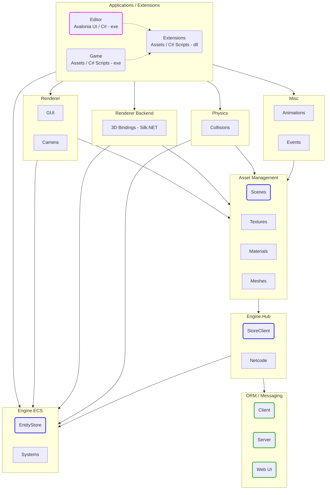
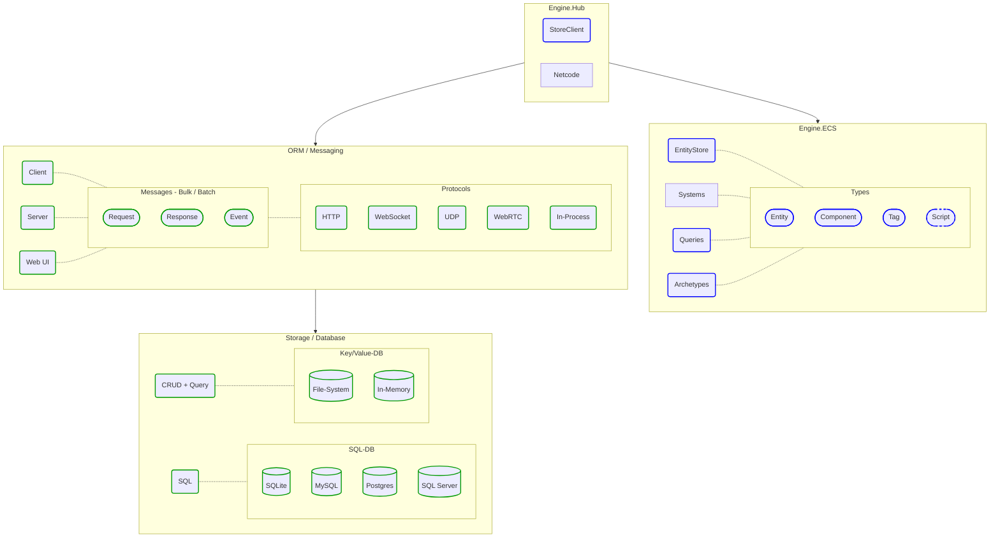
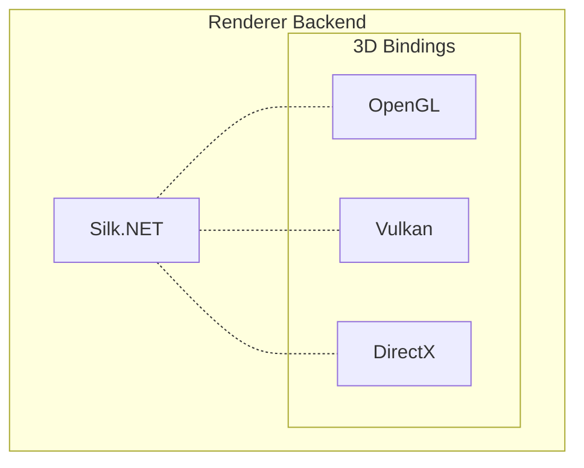
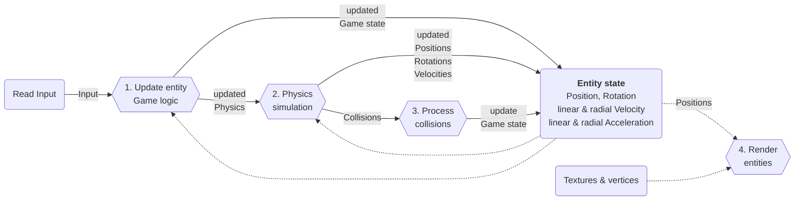

# Architecture


## Engine modules

| Topic             | Project                   | Link                                                                                                      |
| ----------------- | ------------------------- | --------------------------------------------------------------------------------------------------------------------------------------------- |
| Graphics API      | OpenGL ES 3.2 /           | [Open Graphics Library for Embedded Systems – Wikipedia](https://de.wikipedia.org/wiki/Open_Graphics_Library_for_Embedded_Systems)
|                   | Silk.NET                  | [Silk.NET](https://github.com/dotnet/Silk.NET)
| Physics           | bepuphysics2 (not sure)   | [Pure C# 3D real time physics simulation library, now with a higher version](https://github.com/bepu/bepuphysics2)
|                   |                           | [physics-engine github topics/ C#](https://github.com/topics/physics-engine?l=c%23)
| Data structure    | ECS                       | [ECS - FAQ](https://github.com/SanderMertens/ecs-faq)
|                   | SIMD                      | [Get Started with the Unity* Entity Component System (ECS), C# Job...](https://www.intel.com/content/www/us/en/developer/articles/guide/get-started-with-the-unity-entity-component-system-ecs-c-sharp-job-system-and-burst-compiler.html)
|                   |                           | [Single Instruction, Multiple Data (SIMD) in .NET](https://antao-almada.medium.com/single-instruction-multiple-data-simd-in-net-393b8cf9a90)
| Storage           | Fliox.Hub JSON / SQLite   | [Database providers](https://github.com/friflo/Friflo.Json.Fliox#-database-providers)
| Netcode           | Fliox.Hub Protocol        | [Hub Protocol](https://github.com/friflo/Friflo.Json.Fliox/blob/main/Json/Fliox.Hub/Protocol/README.md)
|                   | Client                    | [FlioxClient](https://github.com/friflo/Friflo.Json.Fliox/blob/main/Json/Fliox.Hub/Client/README.md)
|                   | Server                    | [FlioxHub](https://github.com/friflo/Friflo.Json.Fliox/blob/main/Json/Fliox.Hub/Host/README.md)
| Scripting         | C#                        | As the whole engine is implement in .NET calling its API has no marshalling overhead
| Editor UI         | Avalonia UI               | [Avalonia Play](https://play.avaloniaui.net/)
|                   |                           | [Avalonia - Get Started](https://docs.avaloniaui.net/docs/next/welcome)
| Editor Reload     | AssemblyLoadContext       | C# using AssemblyLoadContext to edit / unload / reload editor workflow loop
|                   |                           | [Example](https://github.com/dotnet/samples/blob/main/core/tutorials/Unloading/Host/Program.cs)
|                   |                           | [How to use and debug assembly unloadability in .NET](https://learn.microsoft.com/en-us/dotnet/standard/assembly/unloadability)

<div style="background:#ffffff; display: flex; justify-content: center; border-radius: 6px; border: 1px solid;">
    <div style="color:#9E00AF; font-weight: bold; padding-right:10px; font-size:15px;"> It's not a game!</div>
    🎮 😎
</div>

<br/><br/>

## Build Editor

The Editor can be build and launched on Windows, macOS (both tested) and Linux (untested).

### Dependency

**.NET SDK 8.0**  
1. Download and install SDK [.NET 8.0](https://dotnet.microsoft.com/en-us/download/dotnet/8.0)

2. Check if .NET SDK CLI is available by requesting its version.  
   If installed properly it returns  
   `8.0.100`  
   or a higher version if using a newer .NET SDK.
```cmd
dotnet --version
```

3. Clone git repository: https://github.com/friflo/Friflo.Json.Fliox

4. Navigate to folder: `./Engine/Editor`  
   Assuming you are in the root folder of the git repository.
```cmd
cd ./Engine/Editor
```

5. Build & Launch with
```cmd
dotnet run
```

6. When the Editor launches is also starts an HTTP server at:  
   http://localhost:5000/  
   The server has a Web UI with the following features:
   - Access and modify entities in the **Explorer** panel.
   - Subscribe to entity changes in the **Pub-Sub** panel.
   - The server can be accessed using the REST or Websocket API to access and modify entities using HTTP.  
     These API's can be tested in the **Playground** panel.

   To get an impression about the WebUI of a similar server checkout the [DemoHub](http://ec2-18-215-176-108.compute-1.amazonaws.com/fliox/).


7. Launch without build - *optional*  
   The Editor should launch in less than a second.
```cmd
dotnet run --no-build
```

<br/><br/>


## Engine Architecture

The arrows used in the diagrams show the dependencies. E.g. `Engine.Hub` *depends on* `Engine.ECS`



## Engine.Hub


## Renderer Backend

<br/><br/>


## Graphics API

*Alternatives*
- [OpenTK](https://github.com/opentk/opentk)
- [Veldrid](https://github.com/veldrid/veldrid)

<br/><br/>


## Physics

*Alternatives*

<br/><br/>


## Editor UI

[Avalonia](https://docs.avaloniaui.net/docs/next/welcome)
supported platform: Windows, macOS, Linux, iOS, Android, WebAssembly & Tizen.  
Is uses the [Skia rendering engine](https://docs.avaloniaui.net/docs/getting-started/programming-with-avalonia/graphics-and-animations)
by default.  
This enables UI rendering is exactly the same on all platforms with a single codebase.

*Alternatives*
- [Uno Platform](https://github.com/unoplatform/uno)
- [Uno Platform: Your Apps Everywhere - Martin Zikmund - NDC London 2023 - YouTube](https://www.youtube.com/watch?v=BTgp9VyZSs8)

<br/><br/>


## Scripting

<br/><br/>


## `EntityStore` / `EntityStoreSync`

Both `EntityStore` and `EntityStoreSync` are used to store game entities.  
The `EntityStore` store `Entity`'s at runtime.  
A `EntityStoreSync` instance store serialized `Entity`'s as `DataEntity`'s in databases or scene files and transfer them via a network.  

Using the `EntityStore` / `EntityStoreSync` enables instant synchronization of a game scene between multiple creators.  
In this workflow the game scene is stored in a shared database without using a version control system like `Git`.  

The common approach to store game scenes in scene files is also available.  
It is the preferred use case when sharing demos or assets via a GitHub project or a file bundle.


### `EntityStore`

The `EntityStore` is used almost without exception when scripting game logic / script with **C#**.  
It stores game entities at runtime by using an ECS data structure.  
Its focus is simplicity and performance.  

Scripting is mainly driven by the API of `Entity`'s stored in a `EntityStore`.  
The performance and efficiency is implemented by using ECS as data structure.

A `EntityStore` stores game entities in a hierarchy - a tree graph to build a game scene.  
Game entities in this hierarchy can be declared as sub scene to persist them as separate scene files on disk.  
The use case of sub scenes is to enhance the scene structure and minimize merge conflicts when used by multiple creators.


### `EntityStoreSync`

The `EntityStoreSync` is used to convert `Entity`'s to `DataEntity`'s or vise versa so that they can be stored in 
scene files or in a database.


## Data structure

The engine uses **ECS** as its fundamental data structure.  
The strength of **ECS** is enabling high memory locality and reduced memory usage by storing entity data in linear memory.

Many stages in the pipeline processing entity data benefits from this approach.




Features of an `EntityStore`
- Store a map (container) of entities in linear memory.
- Organize entities in a tree structure starting with a single root entity.
- Store the components (e.g. `Position`) of entities with the same `Archetype` in linear memory.  
  Basically the **E** & **C** of an **ECS** architecture.

Types:
- `EntityStore` - the storage for all entities and their components.
- `Entity`      - each instances contains the following properties
    - `id`          - type: `int` / id > 0
    - `children`    - contains and array of child entity `id`'s.
    - `components`
        - **Component**'s stored in `Archetype`'s.  
          These are value types - `struct`'s implementing `IComponent` - containing only data and **no** methods.
        - **Script**'s components.  
          Script components are reference types - `class`'es extending `Script` - and **have** methods.
    - `tags`        - list of tags assigned to an entity. Tags have no data.
- `Archetype`       - contains all entities with the same set of **struct** `IComponent` types.  
The **struct** components of an `Archetype` are stored linear in memory to improve memory locality.  
Each component is indexed from 0, ... , N.  
Its property `EntityIds` stores the entity `id`'s each component is owned by.


Serialized entity example

```javascript
{
    "id": 11,
    "children": [1,2,3],                    // can be null
    "components": {                         // can be null
        "name": "Root",                     // IComponent
        "pos": { x: 1, y: 2, x: 3},         // IComponent
        "rot": { x: 0, y: 0, x: 0, w: 0 },  // IComponent
        "my1": { a: 1 }                     // Script
    },
    "tags":["PlayerTag"]                    // can be null
}
```

Note:  
Both component types are serialized into the same `components` array.  
The engines uses the registered **`IComponent`** or **`Script`** type for serialization.

This enables reading already serialized data after refactoring a **`Script`** to an **`IComponent`** or vice versa.


### Entity serialization model

Entities are loaded using a `EntityClient`

```csharp
public sealed class DataEntity
{
    public  long            id;         // pid - permanent id
    public  List<long>      children;   // can be null
    public  JsonValue       components; // can be null
    public  List<string>    tags;       // can be null
    public  string          preFab;     // can be null
    public  string          nodeRef;    // can be null
}

public class EntityClient : FlioxClient
{
    public  readonly    EntitySet <long, DataEntity>   entities;
    
    public EntityClient(FlioxHub hub, string dbName = null) : base (hub, dbName) { }
}
```

Remarks:

- Each entity has a unique id.

- Entities of a scene can be store in various ways:
  - Store all entities in a single JSON file. The order of entities is preserved to minimize merge conflicts.
  - Store each entity in an individual file using its id as file name.
  - Store all entities in a relational database like SQLite using the entity id as the primary key.

- Entity `id`'s used in a scene are stable (permanent). So references to them are stable too.

- Each entity must have only one parent so it must be included in only one `DataEntity.children`.

- When creating new entities in a scene the engine creates random `id`'s by default using `PidType.RandomPids`.

  Using random id's avoid merge conflicts when multiples users make changes to the same scene file / database.  
  The probability generating the same id by two different users is:

  p = 1 - exp(-r^2 / (2 * N))
  
  r:  number of new entities added by a user to an existing scene (not the number of all entities)  
  N:  number of possible values = int.MaxValue = 2147483647

  E.g Adding 1000 entities by two different users to the same scene.  
  p = 1 - exp(-1000^2 / (2 * 2147483647)) = 0.000232 = 0.0232 %
  
  See: https://en.wikipedia.org/wiki/Birthday_problem


### Loading / Storing game entities

Entities are loaded using a `EntityStoreSync` instance created with a `EntityStore` and a `EntityClient`.  
There are two ways to load or save a game scene.

1. Synchronize the entities of a `EntityStore` with a `SQL` or `Key/Value` database using
   `EntityStoreSync.LoadEntities()` / `EntityStoreSync.StoreEntities()`.
2. Load / Save a game scene as a `JSON` file to disk using
   `EntitySerializer.ReadIntoStore()` / `EntitySerializer.WriteStore()`.

In case of a database entities are loaded / stored in batches of 10.000 entities using a `EntityClient`.  

The entity tree is build by utilizing the field `children` of a `DataEntity`.  
In case ids in `children` are inconsistent the errors can be ignored or cause a loading error.

Possible inconsistencies:
- Same entity id in `children` is used in multiple records.
- Entities are referencing each other resulting in a cyclic dependency.
