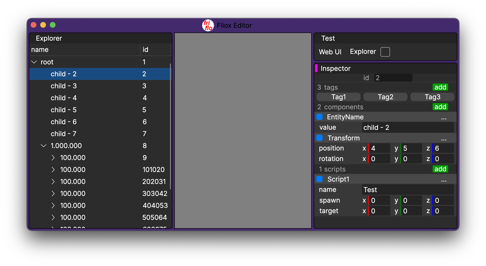
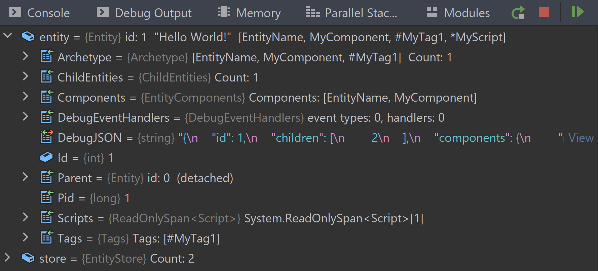

[](https://github.com/friflo/Friflo.Json.Fliox/blob/main/Engine/README.md)   

[](https://www.nuget.org/packages/Friflo.Engine.ECS) 
[](https://github.com/friflo/Friflo.Json.Fliox/actions/workflows/engine.yml) 
[](https://github.com/friflo/Friflo.Json.Fliox/actions/workflows/nuget-engine.yml) 


# Friflo.Engine.ECS

Currently fastest 🔥 ECS implementation in .NET - using **Ecs.CSharp.Benchmark** as reference.  
See benchmark results - Mac Mini M2 - at the bottom of this page.  
This ECS is an Archetype / AoS based Entity Component System. See: [ECS - Wikipedia](https://en.wikipedia.org/wiki/Entity_component_system).   

Maybe this project is a little late at the party. Published on nuget in January 2024. Started development in September 2023.  
The package is part of an in-development Game Editor. See [Architecture.md](Architecture.md).  

The library implements all features a common ECS provides.  
*Unique library features*
- Hybrid ECS - supporting both: Scripts similar to MonoBehaviour's as well as struct components and tags.  
  This enables simple refactoring between both models. Scripts if OOP is suitable. Struct components / tags for performance.
- Build up a hierarchy of entities with parent / child relationship - optional.
- Focus on optimal debugging experience. See screenshot at examples.
- SIMD Support - optional. Multi thread capable and remainder loop free.

For feedback or questions check [Discord](https://discord.gg/nFfrhgQkb8).


# Content
- [Features](#features)
- [Latest features](#latest-features)
- [Development](#development)
- [Examples](#examples)
- [Optimization Examples](#optimization-examples)
- [ECS Benchmarks](#ecs-benchmarks)


# Features

- Performance
    - Use array buffers and cache query instances -> no memory allocations after buffers are large enough.
    - High memory locality by storing components in continuous memory.
    - Optimized for high L1 cache line hit rate.
    - Very good benchmark results at: [Ecs.CSharp.Benchmark - GitHub](https://github.com/Doraku/Ecs.CSharp.Benchmark).
    - Processing components of large queries has the memory bandwidth as bottleneck. Either using multi threading or SIMD.  
      Alternative ECS implementations using C/C++, Rust, Zig or Mojo 🔥 cannot be faster due to the physical limits.
- Developer friendly / OOP like API by exposing the [Entity API](https://github.com/friflo/Friflo.Engine-docs/blob/main/api/Entity.md)
  **struct** as the main interface.  
  Or compare the `Entity` API with other API's at [Engine-comparison.md](Engine-comparison.md).  
  The typical alternative of an ECS implementations is providing a `World` class and using `int` parameters as entity `id`s.
- JSON Serialization
- Record entity changes on arbitrary threads using [CommandBuffer](https://github.com/friflo/Friflo.Engine-docs/blob/main/api/CommandBuffer.md)'s.
- Build a hierarchy of entities typically used in Games and Game Editors.
- Support multi threaded component queries (systems).
- Support for Vectorization (SIMD) of components returned by queries.  
  Returned component arrays have padding elements at the end to enable SIMD processing without a
  [scalar remainder (epilogue) loop](https://llvm.org/docs/Vectorizers.html#epilogue-vectorization).  
  It is preferred over multi threading as it uses only one core providing the same performance as multi threading running on all cores.
- Minimize times required for GC collection by using struct types for entities and components.  
  GC.Collect(1) < 0.8 ms when using 10.000.000 entities.
- Support tagging of entities and use them as a filter in queries.
- Add scripts - similar to `MonoBehavior`'s - to entities in cases OOP is preferred.
- Support observing entity changes by event handlers triggered by adding / removing: components, tags, scripts and child entities.
- Enable binding an entity hierarchy to a [TreeDataGrid - GitHub](https://github.com/AvaloniaUI/Avalonia.Controls.TreeDataGrid)
  in [AvaloniaUI - Website](https://avaloniaui.net/). Screenshot below:    
</img>


# Latest features

Features in this list are also explained in the Examples.

- 1.10.0    Add support for [CommandBuffer](https://github.com/friflo/Friflo.Engine-docs/blob/main/api/CommandBuffer.md)'s.  

- 1.11.0    Support to filter entity changes - like adding/removing components/tags - in queries using an
            [EventFilter](https://github.com/friflo/Friflo.Engine-docs/blob/main/api/EventFilter.md).  

- 1.12.0    Add additional query filters like `WithoutAnyTags()` using an
            [ArchetypeQuery](https://github.com/friflo/Friflo.Engine-docs/blob/main/api/ArchetypeQuery.md).  

- 1.13.0    Add support for target framework .NET Standard 2.1 or higher.

- 1.14.0    Add support for parallel (multi threaded) query job execution.

- 1.15.0    Reduced the number of properties shown for an entity in the debugger. See screenshot in Examples. 

- 1.16.0    Add support for entity batches and bulk batch operations to apply multiple entity changes at once.  
            **Changed behavior** of the Archetype assigned to entities without components & tags.  
            *Before:* Entities were not stored in this specific Archetype. `Archetype.Entities` returned always an empty result.  
            *Now:*    Entities are stored in this Archetype.  

- 1.17.0    Introduced `CreateEntityBatch` to optimize creation of entities.  
            Added DebugView's for all IEnumerable<> types to enable one click navigation to their elements in the debugger.  
            E.g. the expanded properties ChildEntities and Components in the examples screenshot.  
            **Breaking change**: Changed property `Entity.Batch` to method `Entity.Batch()`.  


# Development

The library supports target framework **.NET Standard 2.1** or higher.  
This includes .NET Core, .NET 5, .NET 6, .NET 7 and .NET 8.  
Tested: Windows, macOS and Linux. Untested: Android, iOS, tvOS and WASM/WebAssembly.

The library can be build on all platforms a .NET SDK is available.  
Build options:
- `dotnet` CLI       - Windows, macOS, Linux
- Rider              - Windows, macOS, Linux (untested)
- Visual Studio 2022 - Windows
- Visual Studio Code - Windows, macOS, Linux (untested)

## Library
- The nuget package contains four dll's specific for: .NET Standard 2.1, .NET 6, .NET 7 and .NET 8.  
  This enables using the most performant features available for each target.  
  E.g. Some SIMD intrinsics methods available on .NET 7 and .NET 8 but not on earlier versions.
- Build time Windows: ~ 5 seconds, macOS (M2): 2,5 seconds.
- Code coverage of the unit tests: 99,9%. See: [docs/code-coverage.md](docs/code-coverage.md).
- Unit test execution: ~ 1 second.
- Size of `Friflo.Engine.ECS.dll`: ~ 180 kb. The implementation: ~ 14.000 LOC.
- Pure C# implementation - no C/C++ bindings slowing down runtime / development performance.
- The C# API is [CLS-compliant](https://learn.microsoft.com/en-us/dotnet/api/system.clscompliantattribute?view=net-8.0#remarks).
- The library is not using [unsafe code](https://learn.microsoft.com/en-us/dotnet/csharp/language-reference/unsafe-code).
- No custom C# preprocessor directives to enable / disable features within custom builds.
- Deterministic dll build.
- No 3rd party dependencies.
- It requires **Friflo.Json.Fliox** which is part of this repository.

<br/><br/>


# Examples

Examples using **Friflo.Engine.ECS** are part of the unit tests see: [Tests/ECS/Examples.cs](Tests/ECS/Examples.cs)

When testing the examples use a debugger to check entity state changes while stepping throw the code.

</img>  
*Screenshot:* Entity state - enables browsing the entire store hierarchy.

Examples showing typical use cases of the [Entity API](https://github.com/friflo/Friflo.Engine-docs/blob/main/api/Entity.md)

**General**
- [EntityStore](#entitystore)
- [Entity](#entity)
- [Component](#component)
- [Unique entity](#unique-entity)
- [Tag](#tag)
- [Archetype](#archetype)
- [Script](#script)
- [Child entities](#child-entities)
- [Event](#event)
- [Signal](#signal)
- [Query entities](#query-entities)
- [Enumerate Query Chunks](#enumerate-query-chunks)

**Optimization**

- [Parallel Query Job](#parallel-query-job)
- [Query Vectorization - SIMD](#query-vectorization---simd)
- [EventFilter](#eventfilter)
- [Batch - Create Entity](#batch---create-entity)
- [Batch - Entity](#batch---entity)
- [Bulk Batch - Entity](#bulk-batch---entity)
- [CommandBuffer](#commandbuffer)


## EntityStore

An `EntityStore` is a container for entities running as an in-memory database.  
It is highly optimized for efficient storage fast queries and event handling.  
In other ECS implementations this type is typically called *World*.

The store enables to
- create entities
- modify entities - add / remove components, tags, scripts and child entities
- query entities with a specific set of components or tags
- subscribe events like adding / removing components, tags, scripts and child entities

Multiple stores can be used in parallel and act completely independent from each other.  
The example shows how to create a store. Mainly every example will start with this line.

```csharp
public static void CreateStore()
{
    var store = new EntityStore();
}
```


## Entity

An `Entity` has an identity - `Id` - and acts as a container for components, tags, script and child entities.  
Entities are related to a single `EntityStore` and created with `CreateEntity()`.

```csharp
public static void CreateEntity()
{
    var store = new EntityStore();
    store.CreateEntity();
    store.CreateEntity();
    
    foreach (var entity in store.Entities) {
        Console.WriteLine($"entity {entity}");
    }
    // > entity id: 1  []       Info:  []  shows entity has no components, tags or scripts
    // > entity id: 2  []
}
```


## Component

`Components` are `struct`s used to store data on entities.  
Multiple components with different types can be added / removed to / from an entity.  
If adding a component using a type already stored in the entity its value gets updated. 

```csharp
[ComponentKey("my-component")]
public struct MyComponent : IComponent {
    public int value;
}

public static void AddComponents()
{
    var store   = new EntityStore(PidType.UsePidAsId);
    var entity  = store.CreateEntity();
    
    // add components
    entity.AddComponent(new EntityName("Hello World!"));// EntityName is a build-in component
    entity.AddComponent(new MyComponent { value = 42 });
    Console.WriteLine($"entity: {entity}");             // > entity: id: 1  "Hello World!"  [EntityName, Position]
    
    // get component
    Console.WriteLine($"name: {entity.Name.value}");    // > name: Hello World!
    var value = entity.GetComponent<MyComponent>().value;
    Console.WriteLine($"MyComponent: {value}");         // > MyComponent: 42
    
    // Serialize entity to JSON
    Console.WriteLine(entity.DebugJSON);
}
```

Result of `entity.DebugJSON`:
```json
{
    "id": 1,
    "components": {
        "name": {"value":"Hello World!"},
        "my-component": {"value":42}
    }
}
```


## Unique entity

Add a `UniqueEntity` component to an entity to mark it as a *"singleton"* with a unique `string` id.  
The entity can than be retrieved with `EntityStore.GetUniqueEntity()` to reduce code coupling.  
It enables access to a unique entity without the need to pass an entity by external code.   

```csharp
public static void GetUniqueEntity()
{
    var store   = new EntityStore();
    var entity  = store.CreateEntity();
    entity.AddComponent(new UniqueEntity("Player"));    // UniqueEntity is a build-in component
    
    var player  = store.GetUniqueEntity("Player");
    Console.WriteLine($"entity: {player}");             // > entity: id: 1  [UniqueEntity]
}
```


## Tag

`Tags` are `struct`s similar to components - except they store no data.  
They can be utilized in queries similar as components to restrict the amount of entities returned by a query.  
If adding a tag using a type already attached to the entity the entity remains unchanged.

```csharp
public struct MyTag1 : ITag { }
public struct MyTag2 : ITag { }

public static void AddTags()
{
    var store   = new EntityStore();
    var entity  = store.CreateEntity();
    
    // add tags
    entity.AddTag<MyTag1>();
    entity.AddTag<MyTag2>();
    Console.WriteLine($"entity: {entity}");             // > entity: id: 1  [#MyTag1, #MyTag2]
    
    // get tag
    var tag1 = entity.Tags.Has<MyTag1>();
    Console.WriteLine($"tag1: {tag1}");                 // > tag1: True
}
```


## Archetype

An `Archetype` defines a specific set of components and tags for its entities.  
At the same time it is also a container of entities with exactly this combination of components and tags.  

The following comparison shows the difference in modeling types in **ECS** vs **OOP**.  

<table>
<tr>
<th>ECS - Composition</th>
<th>OOP - Polymorphism</th>
</tr>
<tr>
  <td><i>Inheritance</i><br/>
      ECS does not utilize inheritance.<br/>
      It prefers composition over inheritance.
  </td>
  <td><br/>
      Common OPP is based on inheritance.<br/>
      Likely result: A god base class responsible for everything. 😊
  </td>  
</tr>
<tr>
  <td><i>Code coupling</i><br/>
      Data lives in components - behavior in systems.<br/>
      New behaviors does not affect existing code.
  </td>
  <td><br/>
      Data and behavior are both in classes.<br/>
      New behaviors may add dependencies or side effects.
  </td>  
</tr>
<tr>
  <td><i>Storage</i><br/>
      An Archetype is also a container of entities.
  </td>
  <td><br/>
      Organizing containers is part of application code.
  </td>
</tr>
<tr>
  <td><i>Changing a type</i><br/>
      Supported by adding/removing tags or components.
  </td>
  <td><br/>
      Type is fixed an cannot be changed.
  </td>
</tr>
<tr>
  <td><i>Component access / visibility</i><br/>
    Having a reference to an EntityStore enables<br/>
    unrestricted reading and changing of components.
  </td>
  <td><br/>
    Is controlled by access modifiers:<br/>
    public, protected, internal and private.
  </td>
</tr>

<tr>
  <td colspan="2" align="center"><b>Example</b>
  </td>
</tr>

<tr>
<td style="padding:0px;">

```csharp
// No base class Animal in ECS
struct Dog : ITag { }
struct Cat : ITag { }


var store = new EntityStore();

var dogType = store.GetArchetype(Tags.Get<Dog>());
var catType = store.GetArchetype(Tags.Get<Cat>());
WriteLine(dogType.Name);            // [#Dog]

dogType.CreateEntity();
catType.CreateEntity();

var dogs = store.Query().AnyTags(Tags.Get<Dog>());
var all  = store.Query().AnyTags(Tags.Get<Dog, Cat>());

WriteLine($"dogs: {dogs.Count}");   // dogs: 1
WriteLine($"all: {all.Count}");     // all: 2
```

</td>
<td style="padding:0px;">

```csharp
class Animal { }
class Dog : Animal { }
class Cat : Animal { }


var animals = new List<Animal>();

var dogType = typeof(Dog);
var catType = typeof(Cat);
WriteLine(dogType.Name);            // Dog

animals.Add(new Dog());
animals.Add(new Cat());

var dogs = animals.Where(a => a is Dog);
var all  = animals.Where(a => a is Dog or Cat);

WriteLine($"dogs: {dogs.Count()}"); // dogs: 1
WriteLine($"all: {all.Count()}");   // all: 2
```

</td>
</tr>

<tr>
  <td colspan="2" align="center"><b>Performance</b>
  </td>
</tr>
<tr>
  <td><i>Runtime complexity O() of queries for specific types</i><br/>
      O(size of result set)
  </td>
  <td><br/>
      O(size of all objects)
  </td>
</tr>
<tr>
  <td><i>Memory layout</i><br/>
      Continuous memory in heap - high hit rate of L1 cache.
  </td>
  <td><br/>
      Randomly placed in heap - high rate of L1 cache misses.
  </td>
</tr>
<tr>
  <td><i>Instruction pipelining</i><br/>
      Minimize conditional branches in update loops.<br/>
      Process multiple components at once using SIMD.
  </td>
  <td><br/><br/>
      Virtual method calls prevent branch prediction.
  </td>
</tr>

</table>
<br/>


## Script

`Script`s are similar to components and can be added / removed to / from entities.  
`Script`s are classes and can also be used to store data.  
Additional to components they enable adding behavior in the common OOP style.

In case dealing only with a few thousands of entities `Script`s are fine.  
If dealing with a multiple of 10.000 components should be used for efficiency / performance.

```csharp
public class MyScript : Script { public int data; }

public static void AddScript()
{
    var store   = new EntityStore();
    var entity  = store.CreateEntity();
    
    // add script
    entity.AddScript(new MyScript{ data = 123 });
    Console.WriteLine($"entity: {entity}");             // > entity: id: 1  [*MyScript]
    
    // get script
    var myScript = entity.GetScript<MyScript>();
    Console.WriteLine($"data: {myScript.data}");        // > data: 123
}
```


## Child entities

A typical use case in Games or Editor is to build up a hierarchy of entities.  
To add an entity as a child to another entity use `Entity.AddChild()`.  
In case the added child already has a parent it gest removed from the old parent.  
The children of the added (moved) entity remain being its children.  
If removing a child from its parent all its children are removed from the hierarchy.

```csharp
public static void AddChildEntities()
{
    var store   = new EntityStore();
    var root    = store.CreateEntity();
    var child1  = store.CreateEntity();
    var child2  = store.CreateEntity();
    
    // add child entities
    root.AddChild(child1);
    root.AddChild(child2);
    
    Console.WriteLine($"child entities: {root.ChildEntities}"); // > child entities: Count: 2
}
```


## Event

If changing an entity by adding or removing components, tags, scripts or child entities events are emitted.  
An application can subscribe to these events like shown in the example.  
Emitting these type of events increase code decoupling.  
Without events these modifications need to be notified by direct method calls.  
The *build-in* events can be subscribed on `EntityStore` and on `Entity` level like shown in the example below.  

```csharp
public static void AddEventHandlers()
{
    var store   = new EntityStore();
    var entity  = store.CreateEntity();
    entity.OnComponentChanged     += ev => { Console.WriteLine(ev); }; // > entity: 1 - event > Add Component: [MyComponent]
    entity.OnTagsChanged          += ev => { Console.WriteLine(ev); }; // > entity: 1 - event > Add Tags: [#MyTag1]
    entity.OnScriptChanged        += ev => { Console.WriteLine(ev); }; // > entity: 1 - event > Add Script: [*MyScript]
    entity.OnChildEntitiesChanged += ev => { Console.WriteLine(ev); }; // > entity: 1 - event > Add Child[0] = 2

    entity.AddComponent(new MyComponent());
    entity.AddTag<MyTag1>();
    entity.AddScript(new MyScript());
    entity.AddChild(store.CreateEntity());
}
```

## Signal

`Signal`s are similar to events. They are used to send and receive custom events on entity level in an application.  
They have the same characteristics as events described in the section above.  
The use of `Signal`'s is intended for scenarios when something happens occasionally.  
This avoids the need to check a state every frame.

```csharp
public readonly struct MySignal { } 

public static void AddSignalHandler()
{
    var store   = new EntityStore();
    var entity  = store.CreateEntity();
    entity.AddSignalHandler<MySignal>(signal => { Console.WriteLine(signal); }); // > entity: 1 - signal > MySignal    
    entity.EmitSignal(new MySignal());
}
```


## Query entities

As described in the intro queries are a fundamental feature of an ECS.  
**Friflo.Engine.ECS** support queries by any combination of component types and tags.

See [ArchetypeQuery - API](https://github.com/friflo/Friflo.Engine-docs/blob/main/api/ArchetypeQuery.md)
for available query filters to reduce the number of entities / components returned by a query.  

`ArchetypeQuery` and all its generic variants returned by `store.Query()` are designed for reuse.  
So their references can be stored and used when needed to avoid unnecessary allocations.

```csharp
public static void EntityQueries()
{
    var store   = new EntityStore();
    
    var entity1 = store.CreateEntity();
    entity1.AddComponent(new EntityName("test"));
    entity1.AddTag<MyTag1>();
    
    var entity2 = store.CreateEntity();
    entity2.AddTag<MyTag1>();
    
    var entity3 = store.CreateEntity();
    entity3.AddTag<MyTag1>();
    entity3.AddTag<MyTag2>();
    
    // --- query components
    var queryNames = store.Query<EntityName>();
    Console.WriteLine($"EntityName:     {queryNames.Entities}");    // > EntityName:     Entity[1]
    
    // --- query tags
    var queryTag  = store.Query().AllTags(Tags.Get<MyTag1>());
    Console.WriteLine($"MyTag1:         {queryTag.Entities}");      // > MyTag1:         Entity[3]
    
    var queryTags = store.Query().AllTags(Tags.Get<MyTag1, MyTag2>());
    Console.WriteLine($"MyTag1, MyTag2: {queryTags.Entities}");     // > MyTag1, MyTag2: Entity[1]
}
```

Some optional filter snippets used to shrink the result set returned by a query.

```csharp
    .AllTags(Tags.Get<MyTag1>());                   // query will contain only entities having all given tags
    .WithoutAnyTags(Tags.Get<MyTag1, MyTag2>());    // entities having any of the given tags are excluded from query
    .AllComponents(ComponentTypes.Get<Position>);   // query will contain only entities having all given components
```


## Enumerate Query Chunks

Also as described in the intro enumeration of a query result is fundamental for an ECS.  
Components are returned as [Chunk](https://github.com/friflo/Friflo.Engine-docs/blob/main/api/Chunk_T_.md)'s and are suitable for
[Vectorization - SIMD](https://en.wikipedia.org/wiki/Single_instruction,_multiple_data).

```csharp
public static void EnumerateQueryChunks()
{
    var store   = new EntityStore();
    for (int n = 0; n < 3; n++) {
        var entity = store.CreateEntity();
        entity.AddComponent(new MyComponent{ value = n + 42 });
    }
    var query = store.Query<MyComponent>();
    foreach (var (components, entities) in query.Chunks)
    {
        foreach (var component in components.Span) {
            Console.WriteLine($"MyComponent.value: {component.value}");
            // > MyComponent.value: 42
            // > MyComponent.value: 43
            // > MyComponent.value: 44
        }
    }
}
```
<br/><br/>


# Optimization Examples

Examples in this section are targeting for performance optimization.  
The same functionality can be realized by using the features described in the examples above.  
Performance optimizations are achieved by SIMD, multi threading / parallelization, batching or bulk operations.


## Parallel Query Job

To minimize execution time for large queries a [QueryJob](https://github.com/friflo/Friflo.Engine-docs/blob/main/api/QueryJob.md) can be used.  
It provides the same functionality as the **foreach** loop in example above but runs on multiple cores in parallel. E.g.
```csharp
    foreach (var (components, entities) in query.Chunks) { ... }
```
To enable running a query job a [ParallelJobRunner](https://github.com/friflo/Friflo.Engine-docs/blob/main/api/ParallelJobRunner.md) is required.  
The runner can be assigned to the `EntityStore` or directly to the `QueryJob`.  
A `ParallelJobRunner` instance is thread-safe and can / should be used for multiple / all query jobs.

```csharp
public static void ParallelQueryJob()
{
    var runner  = new ParallelJobRunner(Environment.ProcessorCount);
    var store   = new EntityStore { JobRunner = runner };
    for (int n = 0; n < 10_000; n++) {
        store.CreateEntity().AddComponent<MyComponent>();
    }
    var query = store.Query<MyComponent>();
    var queryJob = query.ForEach((myComponents, entities) =>
    {
        // multi threaded query execution running on all available cores 
        foreach (ref var myComponent in myComponents.Span) {
            myComponent.value += 10;                
        }
    });
    queryJob.RunParallel();
    runner.Dispose();
}
```
In case of structural changes inside the `ForEach((...) => {...})` delegate use a
[CommandBuffer](https://github.com/friflo/Friflo.Engine-docs/blob/main/api/CommandBuffer.md)
to record the changes.  
Structural changes are adding / removing components, tags or child entities and the creation / deletion of entities.  
After `RunParallel()` returns these changes can be applied to the `EntityStore` by calling `CommandBuffer.Playback()`.


## Query Vectorization - SIMD

The most efficient way to speedup query execution is vectorization.  
Vectorization is similar to loop unrolling - aka loop unwinding - but with hardware support.  
Its efficiency is superior to multi threading as it requires only a single thread to achieve the same performance gain.  
So other threads can still keep running without competing for CPU resources.  

*Note:* Vectorization can be combined with multi threading to speedup execution even more.  
In case of a system with high memory bandwidth the speedup is *speedup(SIMD) * speedup(multi threading)*.  
If SIMD or multi threading alone already reaches this bandwidth bottleneck their combination provide no performance gain.

The API provide a few methods to convert chunk components into [System.Runtime.Intrinsics - Vectors](https://learn.microsoft.com/en-us/dotnet/api/system.runtime.intrinsics).  
E.g. `AsSpan256<>` and `StepSpan256`. See all methods at the [Chunk - API](https://github.com/friflo/Friflo.Engine-docs/blob/main/api/Chunk_T_.md).  
The `Span` retrieved from a  chunk component has padding components at the end to enable vectorization without a scalar remainder loop.

The following examples shows how to increment all `MyComponent.value`'s by 1.  

```csharp
public static void QueryVectorization()
{
    var store   = new EntityStore();
    for (int n = 0; n < 10_000; n++) {
        store.CreateEntity().AddComponent<MyComponent>();
    }
    var query = store.Query<MyComponent>();
    foreach (var (component, entities) in query.Chunks)
    {
        // increment all MyComponent.value's. add = <1, 1, 1, 1, 1, 1, 1, 1>
        var add     = Vector256.Create<int>(1);         // create int[8] vector - all values = 1
        var values  = component.AsSpan256<int>();       // values.Length - multiple of 8
        var step    = component.StepSpan256;            // step = 8
        for (int n = 0; n < values.Length; n += step) {
            var slice   = values.Slice(n, step);
            var result  = Vector256.Create<int>(slice) + add; // execute 8 add instructions in one CPU cycle
            result.CopyTo(slice);
        }
    }
}
```


## EventFilter

An alternative to process entity changes - see section [Event](#event) - are `EventFilter`'s.  
`EventFilter`'s can be used on its own or within a query like in the example below.  
All events that need to be filtered - like added/removed components/tags - can be added to the `EventFilter`.  
E.g. `ComponentAdded<Position>()` or `TagAdded<MyTag1>`.  

```csharp
public static void FilterEntityEvents()
{
    var store   = new EntityStore();
    store.EventRecorder.Enabled = true; // required for EventFilter
    
    store.CreateEntity();
    store.CreateEntity().AddComponent<Position>();
    store.CreateEntity().AddTag      <MyTag1>();
    
    var query = store.Query();
    query.EventFilter.ComponentAdded<Position>();
    query.EventFilter.TagAdded<MyTag1>();
    
    foreach (var entity in store.Entities)
    {
        bool hasEvent = query.HasEvent(entity.Id);
        Console.WriteLine($"{entity} - hasEvent: {hasEvent}");
    }
    // > id: 1  [] - hasEvent: False
    // > id: 2  [Position] - hasEvent: True
    // > id: 3  [#MyTag1] - hasEvent: True
}
```


## Batch - Create Entity

Creating entities can be optimized if knowing the components and tags required by an entity in advance.  
This prevent structural changes every time a component or tag is added to an exiting entity.  
Entities can be created by using `store.Batch()` or an [CreateEntityBatch](https://github.com/friflo/Friflo.Engine-docs/blob/main/api/CreateEntityBatch.md)
instance.

It can also be used to create multiple entities all with the same set of components and tags.

```csharp
public static void CreateEntityBatch()
{
    var store   = new EntityStore();
    var entity  = store.Batch()
        .Add(new EntityName("test"))
        .Add(new Position(1,1,1))
        .CreateEntity();
    Console.WriteLine($"entity: {entity}");             // > entity: id: 1  "test"  [EntityName, Position]

    // Create a batch - can be cached if needed.
    var batch = new CreateEntityBatch(store).AddTag<MyTag1>();
    for (int n = 0; n < 10; n++) {
        batch.CreateEntity();
    }
    var taggedEntities = store.Query().AllTags(Tags.Get<MyTag1>());
    Console.WriteLine(taggedEntities);                  // > Query: [#MyTag1]  Count: 10
}
```


## Batch - Entity

When adding/removing components or tags to/from a single entity it will be moved to a new archetype.  
This is also called a *structural change* and in comparison to other methods a more costly operation.  
Every component / tag change will cause a *structural change*.

In case of multiple changes on a single entity use an [EntityBatch](https://github.com/friflo/Friflo.Engine-docs/blob/main/api/EntityBatch.md)
to apply all changes at once.  
Using this approach only a single or no *structural change* will be executed.

```csharp
public static void EntityBatch()
{
    var store   = new EntityStore();
    var entity  = store.CreateEntity();
    
    entity.Batch()
        .Add(new Position(1, 2, 3))
        .AddTag<MyTag1>()
        .Apply();
    
    Console.WriteLine($"entity: {entity}");             // > entity: id: 1  [Position, #MyTag1]
}
```


## Bulk Batch - Entity

In cases you need to add/remove components or tags to a set of entities you can use a **bulk operation**.  
Executing these type of changes are most efficient using a bulk operation.  
This can be done by either using `ApplyBatch()` or a common `foreach ()` loop as shown below.


```csharp
public static void BulkBatch()
{
    var store   = new EntityStore();
    for (int n = 0; n < 1000; n++) {
        store.CreateEntity();
    }
    var batch = new EntityBatch();
    batch.Add(new Position(1, 2, 3)).AddTag<MyTag1>();
    store.Entities.ApplyBatch(batch);
    
    var query = store.Query<Position>().AllTags(Tags.Get<MyTag1>());
    Console.WriteLine(query);                           // > Query: [Position, #MyTag1]  Count: 1000
    
    // Same as: store.Entities.ApplyBatch(batch) above
    foreach (var entity in store.Entities) {
        batch.ApplyTo(entity);
    }
}
```


## CommandBuffer

A `CommandBuffer` is used to record changes on multiple entities. E.g. `AddComponent()`.  
These changes are applied to entities when calling `Playback()`.    
Recording commands with a `CommandBuffer` instance can be done on **any** thread.  
`Playback()` must be called on the **main** thread.  
Available commands are in the [CommandBuffer - API](https://github.com/friflo/Friflo.Engine-docs/blob/main/api/CommandBuffer.md).  

This enables recording entity changes in multi threaded application using entity systems / queries.  
In this case enumerations of query results run on multiple worker threads.  
Within these enumerations entity changes are recorded with a `CommandBuffer`.  
After a query thread has finished these changes are executed with `Playback()` on the **main** thread.

```csharp
public static void CommandBuffer()
{
    var store   = new EntityStore();
    var entity1 = store.CreateEntity();
    var entity2 = store.CreateEntity();
    entity1.AddComponent<Position>();
    
    CommandBuffer cb = store.GetCommandBuffer();
    var newEntity = cb.CreateEntity();
    cb.DeleteEntity  (entity2.Id);
    cb.AddComponent  (newEntity, new EntityName("new entity"));
    cb.RemoveComponent<Position>(entity1.Id);        
    cb.AddComponent  (entity1.Id, new EntityName("changed entity"));
    cb.AddTag<MyTag1>(entity1.Id);
    
    cb.Playback();
    
    var entity3 = store.GetEntityById(newEntity);
    Console.WriteLine(entity1);                         // > id: 1  "changed entity"  [EntityName, #MyTag1]
    Console.WriteLine(entity2);                         // > id: 2  (detached)
    Console.WriteLine(entity3);                         // > id: 3  "new entity"  [EntityName]
}
```
<br/><br/>


# ECS Benchmarks

Two benchmarks - subset of [Ecs.CSharp.Benchmark - 2024-02-16](https://github.com/Doraku/Ecs.CSharp.Benchmark/tree/da28d170988949ee36eab62258c6130d473e70ac)
running on a Mac Mini M2.

Made a subset as the other benchmarks are similar only with different parameters.

1. Create 100.000 entities with three components
2. Update 100.000 entities with two components


## 1. Create 100.000 entities with three components

| Method           | Mean        | Error     | StdDev    | Gen0      | Gen1      | Gen2      | Allocated   |
|----------------- |------------:|----------:|----------:|----------:|----------:|----------:|------------:|
| Arch             |  2.411 ms   | 0.0370 ms | 0.0657 ms |         - |         - |         - |  3948.49 KB |
| SveltoECS        | 28.246 ms   | 0.5175 ms | 0.4840 ms |         - |         - |         - |     4.97 KB |
| DefaultEcs       |  5.931 ms   | 0.1179 ms | 0.2685 ms | 2000.0000 | 2000.0000 | 2000.0000 | 19526.04 KB |
| FlecsNet         | 14.896 ms   | 0.1574 ms | 0.1229 ms |         - |         - |         - |     3.81 KB |
| FrifloEngineEcs  |**1.293 ms** | 0.0116 ms | 0.0097 ms | 1000.0000 | 1000.0000 | 1000.0000 |  6758.76 KB |
| HypEcs           | 22.243 ms   | 0.1328 ms | 0.1178 ms | 8000.0000 | 3000.0000 | 3000.0000 | 68762.52 KB |
| LeopotamEcsLite  |  2.646 ms   | 0.0520 ms | 0.0884 ms | 2000.0000 | 2000.0000 | 2000.0000 | 11253.58 KB |
| LeopotamEcs      |  7.944 ms   | 0.1398 ms | 0.1554 ms | 2000.0000 | 2000.0000 | 2000.0000 | 15741.98 KB |
| MonoGameExtended | 25.024 ms   | 0.0763 ms | 0.1232 ms | 4000.0000 | 3000.0000 | 3000.0000 | 30162.07 KB |
| Morpeh_Direct    | 90.162 ms   | 0.2032 ms | 0.1801 ms | 9000.0000 | 5000.0000 | 2000.0000 | 83805.52 KB |
| Morpeh_Stash     | 30.655 ms   | 0.3532 ms | 0.3131 ms | 4000.0000 | 2000.0000 | 1000.0000 | 44720.38 KB |
| RelEcs           | 56.156 ms   | 0.4419 ms | 0.4134 ms | 9000.0000 | 4000.0000 | 3000.0000 | 75714.03 KB |


## 2. Update 100.000 entities with two components

Benchmark parameter: Padding = 0

*Notable fact*  
SIMD MonoThread running on a **single core** beats MultiThread running on 8 cores.  
So other threads can still keep running without competing for CPU resources.  

| Method                          | Mean          | Error     | StdDev    | Median      | Gen0   | Allocated |
|-------------------------------- |--------------:|----------:|----------:|------------:|-------:|----------:|
| Arch_MonoThread                 |    62.29 μs   |  0.039 μs |  0.031 μs |    62.29 μs |      - |         - |
| Arch_MultiThread                |    48.13 μs   |  0.345 μs |  0.322 μs |    48.23 μs |      - |         - |
| DefaultEcs_MonoThread           |   125.48 μs   |  0.507 μs |  0.450 μs |   125.58 μs |      - |         - |
| DefaultEcs_MultiThread          |   127.47 μs   |  1.242 μs |  1.101 μs |   127.46 μs |      - |         - |
| FrifloEngineEcs_MonoThread      |  **55.57 μs** |  0.699 μs |  0.654 μs |    55.57 μs |      - |         - |
| FrifloEngineEcs_MultiThread     |  **15.96 μs** |  0.316 μs |  0.295 μs |    15.94 μs |      - |         - |
| FrifloEngineEcs_SIMD_MonoThread |  **11.94 μs** |  0.012 μs |  0.011 μs |    11.94 μs |      - |         - |
| HypEcs_MonoThread               |    56.30 μs   |  0.050 μs |  0.042 μs |    56.31 μs |      - |     112 B |
| HypEcs_MultiThread              |    62.30 μs   |  0.031 μs |  0.027 μs |    62.30 μs | 0.2441 |    2081 B |
| LeopotamEcsLite                 |   143.43 μs   |  0.063 μs |  0.056 μs |   143.45 μs |      - |         - |
| LeopotamEcs                     |   136.52 μs   |  0.071 μs |  0.066 μs |   136.54 μs |      - |         - |
| MonoGameExtended                |   464.74 μs   |  0.631 μs |  0.590 μs |   465.01 μs |      - |     161 B |
| Morpeh_Direct                   | 1,394.87 μs   | 26.879 μs | 27.603 μs | 1,396.43 μs |      - |       2 B |
| Morpeh_Stash                    | 1,074.20 μs   | 21.396 μs | 58.570 μs | 1,053.22 μs |      - |       2 B |
| RelEcs                          |   249.37 μs   |  0.882 μs |  0.825 μs |   249.44 μs |      - |     169 B |
| SveltoECS                       |   162.80 μs   |  0.688 μs |  0.643 μs |   162.45 μs |      - |         - |
