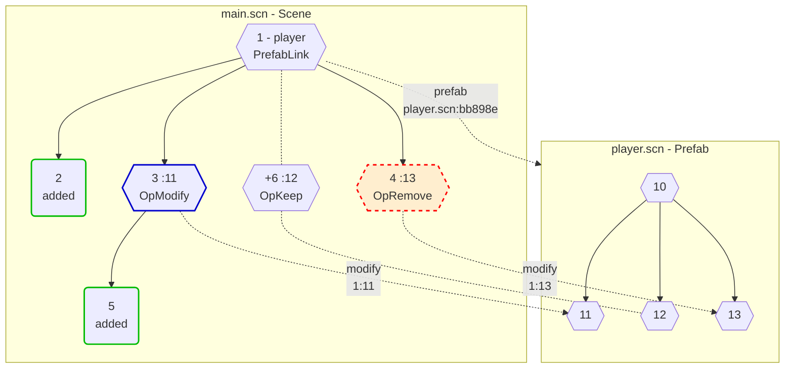

## Prefabs

Prefabs are used to create multiple copies or variations of the same asset in a scene.  

Prefabs are utilized when loading a stored scene into an `EntityStore`.  
Prefabs are used in Edit & Play mode:
- Edit Mode: When loading a scene or when applying changes to a Prefab.
- Play Mode: When loading a scene or to create an Prefab instance while playing.

**Implementation Goals**
- Prefab support:
  - Modify / add components to an existing prefab entity.
  - Add new entities to a prefab.
  - Removing prefab entities.
- The order of entities for loading / saving can be arbitrary.
- Load and Save must be performant to support million of entities.
- Saving as loaded scene:
  - Without modification the result is exactly the same scene file. No diffs in version control.
  - Minor scene modifications result in a small diff.
  - The order of entities remain unchanged to minimize merge conflicts.
- Minimize the amount of data / fields needed to include a Prefab into a scene.
  - `prefab` to link the external prefab.
  - `modify` to modify / remove prefab entities.
- Minimize external links to Prefab: Only one per prefab: `prefab` field.
- Minimize Dictionary<,> lookups when loading or saving. Use simple key type: `int`
- Minimize heap usage when loading or saving. Use structs when possible.
- Minimize usage of utility containers: Currently - `prefabs` and `mods`.
- Enable incremental loading: Entities are added to `EntityStore` while loading.  
  Loaded entities can be used in Editor without waiting for finished loading.
- `DataEntity`'s queried via `EntityClient.Query()` can be cleared after added to `EntityStore`.
- Enable read / write / query entities via HTTP.
- Enable read / write / query and subscribing database changes via WebSocket.

**Non Goals**
- Enable reloading an already loaded scene in the same `EntityStore`.  
  The use case is reloading as modified scene file. The effort and issue probability is too high.  
  Instead a simple alternative is applied. Remove the current `EntityStore` instance and
  create a new one for reloading.

<br/>

### Load entities from `EntityClient` into `EntityStore` using Prefabs

**Precondition**: The entities of a scene are not in any reliable order iteration can rely on.
```typescript
    prefabs: { [id: int]: { link: string, nodes: int[] } }
    mods:    { [id: int]: { componentKeys: string[], node: int, prefabNode: int } }

    type PrefabLink = 0b0001_0000   // link to prefab location
    type OpKeep     = 0b0000_0100   // keep components of prefab entity as they are
    type OpModify   = 0b0000_1000   // modify components of prefab entity
    type OpRemove   = 0b0000_1100   // remove prefab entity

    type NodeFlags  = PrefabLink | OpKeep | OpRemove | OpModify
```

**Load Step 1** - Scene `DataEntity` iteration

Load and iterate all entities of the base scene using an `EntityClient`.  
Update `prefabs`, `mods` and `EntityNode.flags` while iterating.

| `DataEntity`                                 | `id` | flags        | action                                  | remarks
| -------------------------------------------- | ---- | ------------ | --------------------------------------- | -----------
| `modify` == null                             | 2, 5 |              |                                         | common case
| `prefab` != null                             | 1    | `PrefabLink` | `prefabs[1].link = "player.scn:bb898e"` |
| `modify` != null  and  `components` != null  | 3    | `OpModify`   | `mods[3].componentKeys = ["pos"]`       |
|                                              |      |              | `mods[3].node = 1`                      |
|                                              |      |              | `mods[3].prefabNode = 11`               |
| `modify` != null  and  `components` == null  | 4    | `OpRemove`   | `mods[4].componentKeys = null`          |
|                                              |      |              | `mods[4].node = 1`                      |
|                                              |      |              | `mods[4].prefabNode = 13`               |


**Load Step 2** - Add `mods[].node` to `prefabs` map

Iterate all `mods` and add their `node` to `prefabs[].nodes`. Result:
```typescript
    prefabs[1].nodes[11] = 3;       // OpModify
//  prefabs[1].nodes[12] not added
    prefabs[1].nodes[13] = 0;       // OpRemove
```


**Load Step 3** - Prefab `DataEntity` iteration

Iterate all `prefabs`.  
Load prefab and iterate its entities using an `EntityClient`.  
Add `GameObject` components / scripts and set `EntityNode.flags`

| `prefab.nodes`               | `id`   |  flags   | operation                                            | remarks
| ---------------------------- | ------ | -------- | ---------------------------------------------------- | -----------
| `prefab.nodes[11]` != 0      | 11 (3) |          | Add `components` not present `mods[3].componentKeys` | modify entity
| `prefab.nodes[12]` not found | 12 (-) | `OpKeep` | Create new `GameObject` with new id +6               | keep entity - common case
|                              |        |          | + add all Prefab `components`                        | 
| `prefab.nodes[13]` == 0      | 13 (4) |          | Do noting                                            | remove entity

<br/>


### Save entities in `EntityStore` to `EntityClient` using Prefabs

*Note:* Saving prefab entities is utilized only in Edit mode.  
Iterate all `GameObject`'s in the `EntityStore` and update the scene using an `EntityClient`.  
Set `DataEntity.components`, `DataEntity.prefab` and `DataEntity.modify`

| flags         | `id`    | `DataEntity.components`          | `prefab`        | `modify` | operation | remarks
| ------------- | ------- | -------------------------------- | --------------- | -------- | --------- | -------
| 0             | 2, 5    | Add all `GameObject` components  |                 | null     | Upsert()  | common case
| `PrefabLink`  | 1 (10)  |                                  | prefabs[1].link |          | Upsert()  |
| `OpKeep`      | 6 (12)  |                                  |                 |          |           | common prefab case
| `OpModify`    | 3 (11)  | Add `GameObject` components      |                 | `"1:11"` | Upsert()  |
|               |         | matching `mods[3].componentKeys` |                 |          |           |
| `OpRemove`    | 4 (13)  | `null`                           |                 | `"1:13"` | Upsert()  |

<br/>


Scene file: `main.scn`
```js
[{
    "id": 1,
    "children": [2, 3, 4],          // add node 2 to prefab node 10
    "prefab": "player.scn:bb898e"   // link to prefab location
},{ 
    "id": 2
},{
    "id": 3,
    "children": [5],    // add node 5 to prefab node 11
    "components": {     // modified components
        "pos": { "x": 1, "y": 2, "z": 3 }   
    },
    "modify": "1:11"    // modify prefab entity with components -> player.scn:11
},{            
    "id": 4,
    "modify": "1:13"    // remove prefab entity (components == null) -> player.scn:13 
},{            
    "id": 5
}]
```


**Resource file pair**: `player.scn` / `player.scn.info`

**Asset file**: `player.scn`
```js
[{
    "id": 10,
    "children": [11, 12, 13]
},{
    "id": 11
},{
    "id": 12
},{
    "id": 13
}]
```

**Asset info file**: `player.scn.info`
```js
{ "uid": "bb898e" }
```

Remarks:
- Entity `id`'s used in a scene are stable (permanent). So links to them are stable too.

- The tree in a scene file - `main.scn` - remains intact even if the asset file - `player.scn` - is missing.

- Each asset file `<filename>` requires an info file `<filename>.info` storing its `uid`.

  The format of a link to an asset file is: `"<filename>:<uid>"`.  E.g. `"player.scn:bb898e"`  

  Using the filename in a link enables fixing (auto fixing) issues if an `.info` file is missing.  
  Possible reasons for missing `*.info` files:
  - accidentally deleted
  - adding to version control was forgotten
  - an asset file was moved without moving it `*.info` file.
