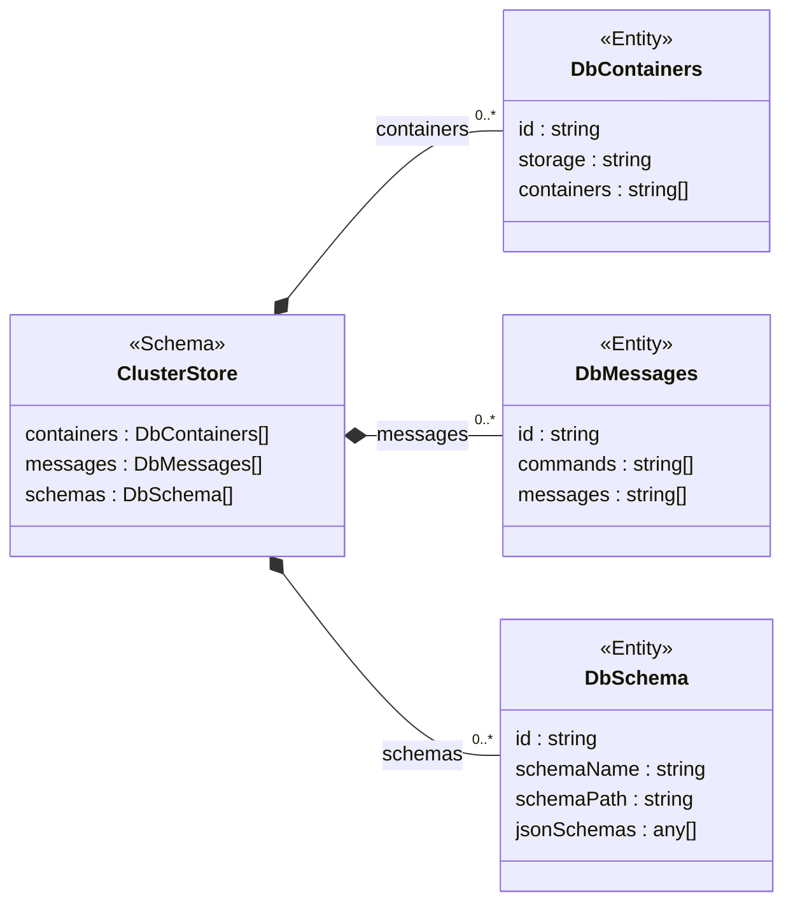

```mermaid
classDiagram
direction LR

class ClusterStore:::cssSchema {
    <<Schema>>
    <<abstract>>
    containers  : DbContainers[]
    messages    : DbMessages[]
    schemas     : DbSchema[]
}
ClusterStore *-- "0..*" DbContainers : containers
ClusterStore *-- "0..*" DbMessages : messages
ClusterStore *-- "0..*" DbSchema : schemas

class DbContainers:::cssEntity {
    <<Entity>>
    id          : string
    storage     : string
    containers  : string[]
}

class DbMessages:::cssEntity {
    <<Entity>>
    id        : string
    commands  : string[]
    messages  : string[]
}

class DbSchema:::cssEntity {
    <<Entity>>
    id           : string
    schemaName   : string
    schemaPath   : string
    jsonSchemas  : any[]
}


```
