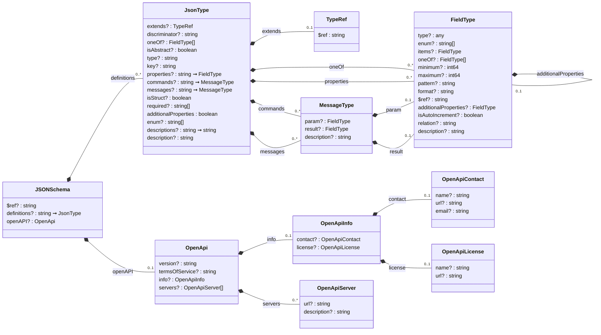

```mermaid
classDiagram
direction LR

class JSONSchema {
    $ref?        : string
    definitions? : string ➞ JsonType
    openAPI?     : OpenApi
}
JSONSchema *-- "0..*" JsonType : definitions
JSONSchema *-- "0..1" OpenApi : openAPI

class JsonType {
    extends?              : TypeRef
    discriminator?        : string
    oneOf?                : FieldType[]
    isAbstract?           : boolean
    type?                 : string
    key?                  : string
    properties?           : string ➞ FieldType
    commands?             : string ➞ MessageType
    messages?             : string ➞ MessageType
    isStruct?             : boolean
    required?             : string[]
    additionalProperties  : boolean
    enum?                 : string[]
    descriptions?         : string ➞ string
    description?          : string
}
JsonType *-- "0..1" TypeRef : extends
JsonType *-- "0..*" FieldType : oneOf
JsonType *-- "0..*" FieldType : properties
JsonType *-- "0..*" MessageType : commands
JsonType *-- "0..*" MessageType : messages

class TypeRef {
    $ref  : string
}

class FieldType {
    type?                 : any
    enum?                 : string[]
    items?                : FieldType
    oneOf?                : FieldType[]
    minimum?              : int64
    maximum?              : int64
    pattern?              : string
    format?               : string
    $ref?                 : string
    additionalProperties? : FieldType
    isAutoIncrement?      : boolean
    relation?             : string
    description?          : string
}
FieldType *-- "0..1" FieldType : items
FieldType *-- "0..*" FieldType : oneOf
FieldType *-- "0..1" FieldType : additionalProperties

class MessageType {
    param?       : FieldType
    result?      : FieldType
    description? : string
}
MessageType *-- "0..1" FieldType : param
MessageType *-- "0..1" FieldType : result

class OpenApi {
    version?        : string
    termsOfService? : string
    info?           : OpenApiInfo
    servers?        : OpenApiServer[]
}
OpenApi *-- "0..1" OpenApiInfo : info
OpenApi *-- "0..*" OpenApiServer : servers

class OpenApiInfo {
    contact? : OpenApiContact
    license? : OpenApiLicense
}
OpenApiInfo *-- "0..1" OpenApiContact : contact
OpenApiInfo *-- "0..1" OpenApiLicense : license

class OpenApiContact {
    name?  : string
    url?   : string
    email? : string
}

class OpenApiLicense {
    name? : string
    url?  : string
}

class OpenApiServer {
    url?         : string
    description? : string
}


```
