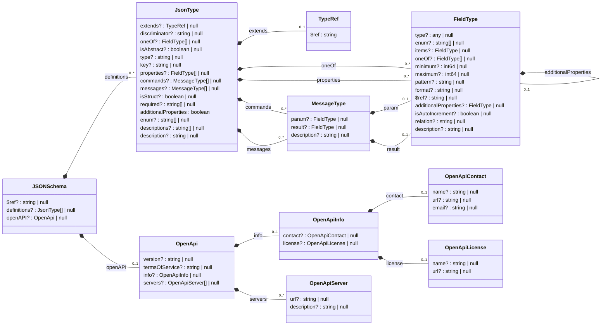

```mermaid
classDiagram
direction LR

class JSONSchema {
    $ref?        : string | null
    definitions? : JsonType[] | null
    openAPI?     : OpenApi | null
}
JSONSchema *-- "0..*" JsonType : definitions
JSONSchema *-- "0..1" OpenApi : openAPI

class JsonType {
    extends?              : TypeRef | null
    discriminator?        : string | null
    oneOf?                : FieldType[] | null
    isAbstract?           : boolean | null
    type?                 : string | null
    key?                  : string | null
    properties?           : FieldType[] | null
    commands?             : MessageType[] | null
    messages?             : MessageType[] | null
    isStruct?             : boolean | null
    required?             : string[] | null
    additionalProperties  : boolean
    enum?                 : string[] | null
    descriptions?         : string[] | null
    description?          : string | null
}
JsonType *-- "0..1" TypeRef : extends
JsonType *-- "0..*" FieldType : oneOf
JsonType *-- "0..*" FieldType : properties
JsonType *-- "0..*" MessageType : commands
JsonType *-- "0..*" MessageType : messages

class TypeRef {
    $ref  : string
}

class FieldType {
    type?                 : any | null
    enum?                 : string[] | null
    items?                : FieldType | null
    oneOf?                : FieldType[] | null
    minimum?              : int64 | null
    maximum?              : int64 | null
    pattern?              : string | null
    format?               : string | null
    $ref?                 : string | null
    additionalProperties? : FieldType | null
    isAutoIncrement?      : boolean | null
    relation?             : string | null
    description?          : string | null
}
FieldType *-- "0..1" FieldType : items
FieldType *-- "0..*" FieldType : oneOf
FieldType *-- "0..1" FieldType : additionalProperties

class MessageType {
    param?       : FieldType | null
    result?      : FieldType | null
    description? : string | null
}
MessageType *-- "0..1" FieldType : param
MessageType *-- "0..1" FieldType : result

class OpenApi {
    version?        : string | null
    termsOfService? : string | null
    info?           : OpenApiInfo | null
    servers?        : OpenApiServer[] | null
}
OpenApi *-- "0..1" OpenApiInfo : info
OpenApi *-- "0..*" OpenApiServer : servers

class OpenApiInfo {
    contact? : OpenApiContact | null
    license? : OpenApiLicense | null
}
OpenApiInfo *-- "0..1" OpenApiContact : contact
OpenApiInfo *-- "0..1" OpenApiLicense : license

class OpenApiContact {
    name?  : string | null
    url?   : string | null
    email? : string | null
}

class OpenApiLicense {
    name? : string | null
    url?  : string | null
}

class OpenApiServer {
    url?         : string | null
    description? : string | null
}


```
