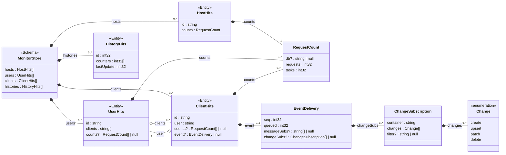

```mermaid
classDiagram
direction LR

class MonitorStore:::cssSchema {
    <<Schema>>
    <<abstract>>
    hosts      : HostHits[]
    users      : UserHits[]
    clients    : ClientHits[]
    histories  : HistoryHits[]
}
MonitorStore *-- "0..*" HostHits : hosts
MonitorStore *-- "0..*" UserHits : users
MonitorStore *-- "0..*" ClientHits : clients
MonitorStore *-- "0..*" HistoryHits : histories

class HostHits:::cssEntity {
    <<Entity>>
    id      : string
    counts  : RequestCount
}
HostHits *-- "1" RequestCount : counts

class UserHits:::cssEntity {
    <<Entity>>
    id       : string
    clients  : string[]
    counts?  : RequestCount[] | null
}
UserHits o.. "0..*" ClientHits : clients
UserHits *-- "0..*" RequestCount : counts

class ClientHits:::cssEntity {
    <<Entity>>
    id      : string
    user    : string
    counts? : RequestCount[] | null
    event?  : EventDelivery | null
}
ClientHits o.. "1" UserHits : user
ClientHits *-- "0..*" RequestCount : counts
ClientHits *-- "0..1" EventDelivery : event

class HistoryHits:::cssEntity {
    <<Entity>>
    id          : int32
    counters    : int32[]
    lastUpdate  : int32
}

class RequestCount {
    db?       : string | null
    requests  : int32
    tasks     : int32
}

class EventDelivery {
    seq          : int32
    queued       : int32
    messageSubs? : string[] | null
    changeSubs?  : ChangeSubscription[] | null
}
EventDelivery *-- "0..*" ChangeSubscription : changeSubs

class ChangeSubscription {
    container  : string
    changes    : Change[]
    filter?    : string | null
}
ChangeSubscription *-- "0..*" Change : changes

class Change:::cssEnum {
    <<enumeration>>
    create
    upsert
    patch
    delete
}


```
