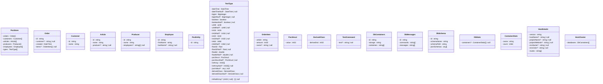

```mermaid
classDiagram

class PocStore {
    - orders     : Order[]
    - customers  : Customer[]
    - articles   : Article[]
    - producers  : Producer[]
    - employees  : Employee[]
    - types      : TestType[]
}

class Order {
    - id        : string
    - customer? : string | null
    - created   : DateTime
    - items?    : OrderItem[] | null
}

class Customer {
    - id    : string
    - name  : string
}

class Article {
    - id        : string
    - name      : string
    - producer? : string | null
}

class Producer {
    - id         : string
    - name       : string
    - employees? : string[] | null
}

class Employee {
    - id         : string
    - firstName  : string
    - lastName?  : string | null
}

class PocEntity {
    - id  : string
}

class TestType {
    - dateTime          : DateTime
    - dateTimeNull?     : DateTime | null
    - bigInt            : BigInteger
    - bigIntNull?       : BigInteger | null
    - boolean           : boolean
    - booleanNull?      : boolean | null
    - uint8             : uint8
    - uint8Null?        : uint8 | null
    - int16             : int16
    - int16Null?        : int16 | null
    - int32             : int32
    - int32Null?        : int32 | null
    - int64             : int64
    - int64Null?        : int64 | null
    - float32           : float
    - float32Null?      : float | null
    - float64           : double
    - float64Null?      : double | null
    - pocStruct         : PocStruct
    - pocStructNull?    : PocStruct | null
    - intArray          : int32[]
    - intArrayNull?     : int32[] | null
    - intNullArray?     : (int32 | null)[] | null
    - jsonValue?        : any | null
    - derivedClass      : DerivedClass
    - derivedClassNull? : DerivedClass | null
}

class OrderItem {
    - article  : string
    - amount   : int32
    - name?    : string | null
}

class PocStruct {
    - value  : int32
}

class DerivedClass {
    - derivedVal  : int32
}

class TestCommand {
    - text? : string | null
}

class DbContainers {
    - id          : string
    - storage     : string
    - containers  : string[]
}

class DbMessages {
    - id        : string
    - commands  : string[]
    - messages  : string[]
}

class DbSchema {
    - id           : string
    - schemaName   : string
    - schemaPath   : string
    - jsonSchemas  : any[]
}

class DbStats {
    - containers? : ContainerStats[] | null
}

class ContainerStats {
    - name   : string
    - count  : int64
}

class HostDetails {
    - version         : string
    - hostName?       : string | null
    - projectName?    : string | null
    - projectWebsite? : string | null
    - envName?        : string | null
    - envColor?       : string | null
    - routes          : string[]
}

class HostCluster {
    - databases  : DbContainers[]
}


```
