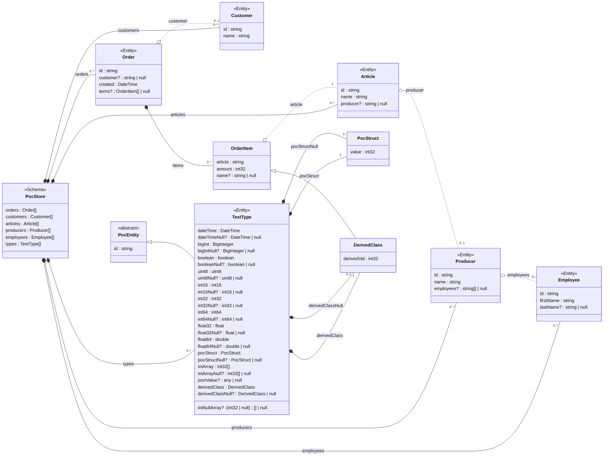

```mermaid
classDiagram
direction LR

class PocStore:::cssSchema {
    <<Schema>>
    <<abstract>>
    orders     : Order[]
    customers  : Customer[]
    articles   : Article[]
    producers  : Producer[]
    employees  : Employee[]
    types      : TestType[]
}
PocStore *-- "0..*" Order : orders
PocStore *-- "0..*" Customer : customers
PocStore *-- "0..*" Article : articles
PocStore *-- "0..*" Producer : producers
PocStore *-- "0..*" Employee : employees
PocStore *-- "0..*" TestType : types

class Order:::cssEntity {
    <<Entity>>
    id        : string
    customer? : string | null
    created   : DateTime
    items?    : OrderItem[] | null
}
Order o.. "0..1" Customer : customer
Order *-- "0..*" OrderItem : items

class Customer:::cssEntity {
    <<Entity>>
    id    : string
    name  : string
}

class Article:::cssEntity {
    <<Entity>>
    id        : string
    name      : string
    producer? : string | null
}
Article o.. "0..1" Producer : producer

class Producer:::cssEntity {
    <<Entity>>
    id         : string
    name       : string
    employees? : string[] | null
}
Producer o.. "0..*" Employee : employees

class Employee:::cssEntity {
    <<Entity>>
    id         : string
    firstName  : string
    lastName?  : string | null
}

class PocEntity {
    <<abstract>>
    id  : string
}

PocEntity <|-- TestType
class TestType:::cssEntity {
    <<Entity>>
    dateTime          : DateTime
    dateTimeNull?     : DateTime | null
    bigInt            : BigInteger
    bigIntNull?       : BigInteger | null
    boolean           : boolean
    booleanNull?      : boolean | null
    uint8             : uint8
    uint8Null?        : uint8 | null
    int16             : int16
    int16Null?        : int16 | null
    int32             : int32
    int32Null?        : int32 | null
    int64             : int64
    int64Null?        : int64 | null
    float32           : float
    float32Null?      : float | null
    float64           : double
    float64Null?      : double | null
    pocStruct         : PocStruct
    pocStructNull?    : PocStruct | null
    intArray          : int32[]
    intArrayNull?     : int32[] | null
    intNullArray?     : (int32 | null)[] | null
    jsonValue?        : any | null
    derivedClass      : DerivedClass
    derivedClassNull? : DerivedClass | null
}
TestType *-- "1" PocStruct : pocStruct
TestType *-- "0..1" PocStruct : pocStructNull
TestType *-- "1" DerivedClass : derivedClass
TestType *-- "0..1" DerivedClass : derivedClassNull

class OrderItem {
    article  : string
    amount   : int32
    name?    : string | null
}
OrderItem o.. "1" Article : article

class PocStruct {
    value  : int32
}

OrderItem <|-- DerivedClass
class DerivedClass {
    derivedVal  : int32
}


```
