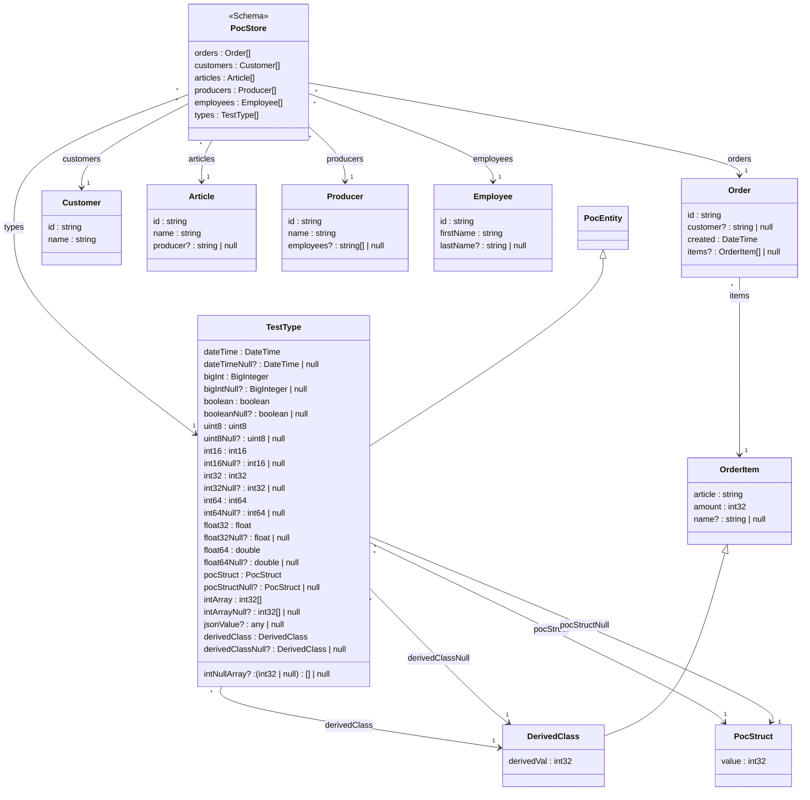

```mermaid
classDiagram

class PocStore {
    <<Schema>>
    orders     : Order[]
    customers  : Customer[]
    articles   : Article[]
    producers  : Producer[]
    employees  : Employee[]
    types      : TestType[]
}
PocStore "*" --> "1" Order : orders
PocStore "*" --> "1" Customer : customers
PocStore "*" --> "1" Article : articles
PocStore "*" --> "1" Producer : producers
PocStore "*" --> "1" Employee : employees
PocStore "*" --> "1" TestType : types

class Order {
    id        : string
    customer? : string | null
    created   : DateTime
    items?    : OrderItem[] | null
}
Order "*" --> "1" OrderItem : items

class Customer {
    id    : string
    name  : string
}

class Article {
    id        : string
    name      : string
    producer? : string | null
}

class Producer {
    id         : string
    name       : string
    employees? : string[] | null
}

class Employee {
    id         : string
    firstName  : string
    lastName?  : string | null
}

PocEntity <|-- TestType
class TestType {
    dateTime          : DateTime
    dateTimeNull?     : DateTime | null
    bigInt            : BigInteger
    bigIntNull?       : BigInteger | null
    boolean           : boolean
    booleanNull?      : boolean | null
    uint8             : uint8
    uint8Null?        : uint8 | null
    int16             : int16
    int16Null?        : int16 | null
    int32             : int32
    int32Null?        : int32 | null
    int64             : int64
    int64Null?        : int64 | null
    float32           : float
    float32Null?      : float | null
    float64           : double
    float64Null?      : double | null
    pocStruct         : PocStruct
    pocStructNull?    : PocStruct | null
    intArray          : int32[]
    intArrayNull?     : int32[] | null
    intNullArray?     : (int32 | null)[] | null
    jsonValue?        : any | null
    derivedClass      : DerivedClass
    derivedClassNull? : DerivedClass | null
}
TestType "*" --> "1" PocStruct : pocStruct
TestType "*" --> "1" PocStruct : pocStructNull
TestType "*" --> "1" DerivedClass : derivedClass
TestType "*" --> "1" DerivedClass : derivedClassNull

class OrderItem {
    article  : string
    amount   : int32
    name?    : string | null
}

class PocStruct {
    value  : int32
}

OrderItem <|-- DerivedClass
class DerivedClass {
    derivedVal  : int32
}


```
