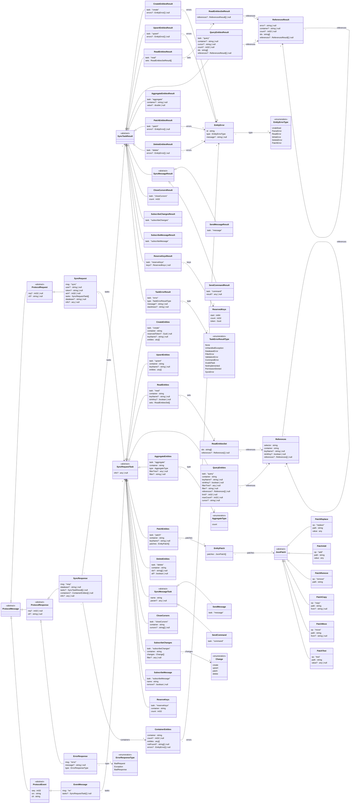

```mermaid
classDiagram
direction LR

class ProtocolMessage {
    <<abstract>>
}

ProtocolMessage <|-- ProtocolRequest
class ProtocolRequest {
    <<abstract>>
    req? : int32 | null
    clt? : string | null
}

ProtocolRequest <|-- SyncRequest
class SyncRequest {
    msg       : "sync"
    user?     : string | null
    token?    : string | null
    ack?      : int32 | null
    tasks     : SyncRequestTask[]
    database? : string | null
    info?     : any | null
}
SyncRequest "*" --> "1" SyncRequestTask : tasks

ProtocolMessage <|-- ProtocolResponse
class ProtocolResponse {
    <<abstract>>
    req? : int32 | null
    clt? : string | null
}

ProtocolResponse <|-- SyncResponse
class SyncResponse {
    msg         : "resp"
    database?   : string | null
    tasks?      : SyncTaskResult[] | null
    containers? : ContainerEntities[] | null
    info?       : any | null
}
SyncResponse "*" --> "1" SyncTaskResult : tasks
SyncResponse "*" --> "1" ContainerEntities : containers

class ContainerEntities {
    container  : string
    count?     : int32 | null
    entities   : any[]
    notFound?  : string[] | null
    errors?    : EntityError[] | null
}
ContainerEntities "*" --> "1" EntityError : errors

ProtocolResponse <|-- ErrorResponse
class ErrorResponse {
    msg      : "error"
    message? : string | null
    type     : ErrorResponseType
}
ErrorResponse "*" --> "1" ErrorResponseType : type

class ErrorResponseType:::cssEnum {
    <<enumeration>>
    BadRequest
    Exception
    BadResponse
}


ProtocolMessage <|-- ProtocolEvent
class ProtocolEvent {
    <<abstract>>
    seq  : int32
    src  : string
    clt  : string
}

ProtocolEvent <|-- EventMessage
class EventMessage {
    msg    : "ev"
    tasks? : SyncRequestTask[] | null
}
EventMessage "*" --> "1" SyncRequestTask : tasks

class ReadEntitiesSet {
    ids         : string[]
    references? : References[] | null
}
ReadEntitiesSet "*" --> "1" References : references

class References {
    selector    : string
    container   : string
    keyName?    : string | null
    isIntKey?   : boolean | null
    references? : References[] | null
}
References "*" --> "1" References : references

class EntityError {
    id       : string
    type     : EntityErrorType
    message? : string | null
}
EntityError "*" --> "1" EntityErrorType : type

class EntityErrorType:::cssEnum {
    <<enumeration>>
    Undefined
    ParseError
    ReadError
    WriteError
    DeleteError
    PatchError
}


class ReadEntitiesSetResult {
    references? : ReferencesResult[] | null
}
ReadEntitiesSetResult "*" --> "1" ReferencesResult : references

class ReferencesResult {
    error?      : string | null
    container?  : string | null
    count?      : int32 | null
    ids         : string[]
    references? : ReferencesResult[] | null
}
ReferencesResult "*" --> "1" ReferencesResult : references

class SyncRequestTask {
    <<abstract>>
    info? : any | null
}

SyncRequestTask <|-- CreateEntities
class CreateEntities {
    task           : "create"
    container      : string
    reservedToken? : Guid | null
    keyName?       : string | null
    entities       : any[]
}

SyncRequestTask <|-- UpsertEntities
class UpsertEntities {
    task       : "upsert"
    container  : string
    keyName?   : string | null
    entities   : any[]
}

SyncRequestTask <|-- ReadEntities
class ReadEntities {
    task       : "read"
    container  : string
    keyName?   : string | null
    isIntKey?  : boolean | null
    sets       : ReadEntitiesSet[]
}
ReadEntities "*" --> "1" ReadEntitiesSet : sets

SyncRequestTask <|-- QueryEntities
class QueryEntities {
    task        : "query"
    container   : string
    keyName?    : string | null
    isIntKey?   : boolean | null
    filterTree? : any | null
    filter?     : string | null
    references? : References[] | null
    limit?      : int32 | null
    maxCount?   : int32 | null
    cursor?     : string | null
}
QueryEntities "*" --> "1" References : references

SyncRequestTask <|-- AggregateEntities
class AggregateEntities {
    task        : "aggregate"
    container   : string
    type        : AggregateType
    filterTree? : any | null
    filter?     : string | null
}
AggregateEntities "*" --> "1" AggregateType : type

class AggregateType:::cssEnum {
    <<enumeration>>
    count
}


SyncRequestTask <|-- PatchEntities
class PatchEntities {
    task       : "patch"
    container  : string
    keyName?   : string | null
    patches    : EntityPatch[]
}
PatchEntities "*" --> "1" EntityPatch : patches

class EntityPatch {
    patches  : JsonPatch[]
}
EntityPatch "*" --> "1" JsonPatch : patches

SyncRequestTask <|-- DeleteEntities
class DeleteEntities {
    task       : "delete"
    container  : string
    ids?       : string[] | null
    all?       : boolean | null
}

SyncRequestTask <|-- SyncMessageTask
class SyncMessageTask {
    <<abstract>>
    name   : string
    param? : any | null
}

SyncMessageTask <|-- SendMessage
class SendMessage {
    task   : "message"
}

SyncMessageTask <|-- SendCommand
class SendCommand {
    task   : "command"
}

SyncRequestTask <|-- CloseCursors
class CloseCursors {
    task       : "closeCursors"
    container  : string
    cursors?   : string[] | null
}

SyncRequestTask <|-- SubscribeChanges
class SubscribeChanges {
    task       : "subscribeChanges"
    container  : string
    changes    : Change[]
    filter?    : any | null
}
SubscribeChanges "*" --> "1" Change : changes

class Change:::cssEnum {
    <<enumeration>>
    create
    upsert
    patch
    delete
}


SyncRequestTask <|-- SubscribeMessage
class SubscribeMessage {
    task    : "subscribeMessage"
    name    : string
    remove? : boolean | null
}

SyncRequestTask <|-- ReserveKeys
class ReserveKeys {
    task       : "reserveKeys"
    container  : string
    count      : int32
}

class SyncTaskResult {
    <<abstract>>
}

SyncTaskResult <|-- CreateEntitiesResult
class CreateEntitiesResult {
    task    : "create"
    errors? : EntityError[] | null
}
CreateEntitiesResult "*" --> "1" EntityError : errors

SyncTaskResult <|-- UpsertEntitiesResult
class UpsertEntitiesResult {
    task    : "upsert"
    errors? : EntityError[] | null
}
UpsertEntitiesResult "*" --> "1" EntityError : errors

SyncTaskResult <|-- ReadEntitiesResult
class ReadEntitiesResult {
    task  : "read"
    sets  : ReadEntitiesSetResult[]
}
ReadEntitiesResult "*" --> "1" ReadEntitiesSetResult : sets

SyncTaskResult <|-- QueryEntitiesResult
class QueryEntitiesResult {
    task        : "query"
    container?  : string | null
    cursor?     : string | null
    count?      : int32 | null
    ids         : string[]
    references? : ReferencesResult[] | null
}
QueryEntitiesResult "*" --> "1" ReferencesResult : references

SyncTaskResult <|-- AggregateEntitiesResult
class AggregateEntitiesResult {
    task       : "aggregate"
    container? : string | null
    value?     : double | null
}

SyncTaskResult <|-- PatchEntitiesResult
class PatchEntitiesResult {
    task    : "patch"
    errors? : EntityError[] | null
}
PatchEntitiesResult "*" --> "1" EntityError : errors

SyncTaskResult <|-- DeleteEntitiesResult
class DeleteEntitiesResult {
    task    : "delete"
    errors? : EntityError[] | null
}
DeleteEntitiesResult "*" --> "1" EntityError : errors

SyncTaskResult <|-- SyncMessageResult
class SyncMessageResult {
    <<abstract>>
}

SyncMessageResult <|-- SendMessageResult
class SendMessageResult {
    task  : "message"
}

SyncMessageResult <|-- SendCommandResult
class SendCommandResult {
    task    : "command"
    result? : any | null
}

SyncTaskResult <|-- CloseCursorsResult
class CloseCursorsResult {
    task   : "closeCursors"
    count  : int32
}

SyncTaskResult <|-- SubscribeChangesResult
class SubscribeChangesResult {
    task  : "subscribeChanges"
}

SyncTaskResult <|-- SubscribeMessageResult
class SubscribeMessageResult {
    task  : "subscribeMessage"
}

SyncTaskResult <|-- ReserveKeysResult
class ReserveKeysResult {
    task  : "reserveKeys"
    keys? : ReservedKeys | null
}
ReserveKeysResult "*" --> "1" ReservedKeys : keys

class ReservedKeys {
    start  : int64
    count  : int32
    token  : Guid
}

SyncTaskResult <|-- TaskErrorResult
class TaskErrorResult {
    task        : "error"
    type        : TaskErrorResultType
    message?    : string | null
    stacktrace? : string | null
}
TaskErrorResult "*" --> "1" TaskErrorResultType : type

class TaskErrorResultType:::cssEnum {
    <<enumeration>>
    None
    UnhandledException
    DatabaseError
    FilterError
    ValidationError
    CommandError
    InvalidTask
    NotImplemented
    PermissionDenied
    SyncError
}


class JsonPatch {
    <<abstract>>
}

JsonPatch <|-- PatchReplace
class PatchReplace {
    op     : "replace"
    path   : string
    value  : any
}

JsonPatch <|-- PatchAdd
class PatchAdd {
    op     : "add"
    path   : string
    value  : any
}

JsonPatch <|-- PatchRemove
class PatchRemove {
    op    : "remove"
    path  : string
}

JsonPatch <|-- PatchCopy
class PatchCopy {
    op    : "copy"
    path  : string
    from? : string | null
}

JsonPatch <|-- PatchMove
class PatchMove {
    op    : "move"
    path  : string
    from? : string | null
}

JsonPatch <|-- PatchTest
class PatchTest {
    op     : "test"
    path   : string
    value? : any | null
}


```
