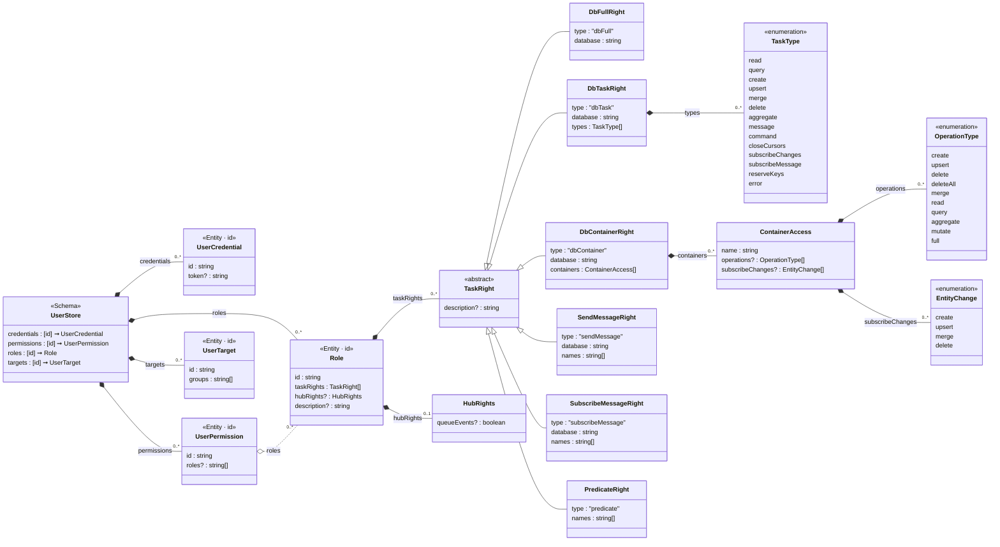

[generated-by]: https://github.com/friflo/Friflo.Json.Fliox#schema

```mermaid
classDiagram
direction LR

class UserStore:::cssSchema {
    <<Schema>>
    <<abstract>>
    credentials  : [id] ➞ UserCredential
    permissions  : [id] ➞ UserPermission
    roles        : [id] ➞ Role
    targets      : [id] ➞ UserTarget
}
UserStore *-- "0..*" UserCredential : credentials
UserStore *-- "0..*" UserPermission : permissions
UserStore *-- "0..*" Role : roles
UserStore *-- "0..*" UserTarget : targets

class UserCredential:::cssEntity {
    <<Entity · id>>
    id     : string
    token? : string
}

class UserPermission:::cssEntity {
    <<Entity · id>>
    id     : string
    roles? : string[]
}
UserPermission o.. "0..*" Role : roles

class Role:::cssEntity {
    <<Entity · id>>
    id           : string
    taskRights   : TaskRight[]
    hubRights?   : HubRights
    description? : string
}
Role *-- "0..*" TaskRight : taskRights
Role *-- "0..1" HubRights : hubRights

class UserTarget:::cssEntity {
    <<Entity · id>>
    id      : string
    groups  : string[]
}

class TaskRight {
    <<abstract>>
    description? : string
}

TaskRight <|-- DbFullRight
class DbFullRight {
    type         : "dbFull"
    database     : string
}

TaskRight <|-- DbTaskRight
class DbTaskRight {
    type         : "dbTask"
    database     : string
    types        : TaskType[]
}
DbTaskRight *-- "0..*" TaskType : types

TaskRight <|-- DbContainerRight
class DbContainerRight {
    type         : "dbContainer"
    database     : string
    containers   : ContainerAccess[]
}
DbContainerRight *-- "0..*" ContainerAccess : containers

class ContainerAccess {
    name              : string
    operations?       : OperationType[]
    subscribeChanges? : EntityChange[]
}
ContainerAccess *-- "0..*" OperationType : operations
ContainerAccess *-- "0..*" EntityChange : subscribeChanges

class OperationType:::cssEnum {
    <<enumeration>>
    create
    upsert
    delete
    deleteAll
    merge
    read
    query
    aggregate
    mutate
    full
}


TaskRight <|-- SendMessageRight
class SendMessageRight {
    type         : "sendMessage"
    database     : string
    names        : string[]
}

TaskRight <|-- SubscribeMessageRight
class SubscribeMessageRight {
    type         : "subscribeMessage"
    database     : string
    names        : string[]
}

TaskRight <|-- PredicateRight
class PredicateRight {
    type         : "predicate"
    names        : string[]
}

class HubRights {
    queueEvents? : boolean
}

class TaskType:::cssEnum {
    <<enumeration>>
    read
    query
    create
    upsert
    merge
    delete
    aggregate
    message
    command
    closeCursors
    subscribeChanges
    subscribeMessage
    reserveKeys
    error
}


class EntityChange:::cssEnum {
    <<enumeration>>
    create
    upsert
    merge
    delete
}


```
