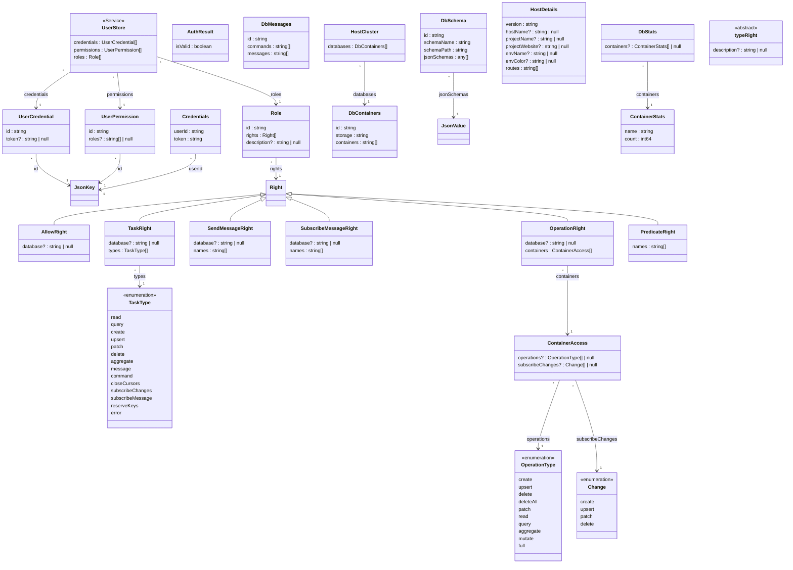

```mermaid
classDiagram

class UserStore {
    <<Service>>
    credentials  : UserCredential[]
    permissions  : UserPermission[]
    roles        : Role[]
}
UserStore "*" --> "1" UserCredential : credentials
UserStore "*" --> "1" UserPermission : permissions
UserStore "*" --> "1" Role : roles

class UserCredential {
    id     : string
    token? : string | null
}
UserCredential "*" --> "1" JsonKey : id

class UserPermission {
    id     : string
    roles? : string[] | null
}
UserPermission "*" --> "1" JsonKey : id

class Role {
    id           : string
    rights       : Right[]
    description? : string | null
}
Role "*" --> "1" Right : rights

class Credentials {
    userId  : string
    token   : string
}
Credentials "*" --> "1" JsonKey : userId

class AuthResult {
    isValid  : boolean
}

class DbContainers {
    id          : string
    storage     : string
    containers  : string[]
}

class DbMessages {
    id        : string
    commands  : string[]
    messages  : string[]
}

class DbSchema {
    id           : string
    schemaName   : string
    schemaPath   : string
    jsonSchemas  : any[]
}
DbSchema "*" --> "1" JsonValue : jsonSchemas

class DbStats {
    containers? : ContainerStats[] | null
}
DbStats "*" --> "1" ContainerStats : containers

class ContainerStats {
    name   : string
    count  : int64
}

class HostDetails {
    version         : string
    hostName?       : string | null
    projectName?    : string | null
    projectWebsite? : string | null
    envName?        : string | null
    envColor?       : string | null
    routes          : string[]
}

class HostCluster {
    databases  : DbContainers[]
}
HostCluster "*" --> "1" DbContainers : databases

class type Right {
    <<abstract>>
    description? : string | null
}

Right <|-- AllowRight
class AllowRight {
    database?    : string | null
}

Right <|-- TaskRight
class TaskRight {
    database?    : string | null
    types        : TaskType[]
}
TaskRight "*" --> "1" TaskType : types

Right <|-- SendMessageRight
class SendMessageRight {
    database?    : string | null
    names        : string[]
}

Right <|-- SubscribeMessageRight
class SubscribeMessageRight {
    database?    : string | null
    names        : string[]
}

Right <|-- OperationRight
class OperationRight {
    database?    : string | null
    containers   : ContainerAccess[]
}
OperationRight "*" --> "1" ContainerAccess : containers

class ContainerAccess {
    operations?       : OperationType[] | null
    subscribeChanges? : Change[] | null
}
ContainerAccess "*" --> "1" OperationType : operations
ContainerAccess "*" --> "1" Change : subscribeChanges

class OperationType {
    <<enumeration>>
    create
    upsert
    delete
    deleteAll
    patch
    read
    query
    aggregate
    mutate
    full
}


Right <|-- PredicateRight
class PredicateRight {
    names        : string[]
}

class TaskType {
    <<enumeration>>
    read
    query
    create
    upsert
    patch
    delete
    aggregate
    message
    command
    closeCursors
    subscribeChanges
    subscribeMessage
    reserveKeys
    error
}


class Change {
    <<enumeration>>
    create
    upsert
    patch
    delete
}


```
