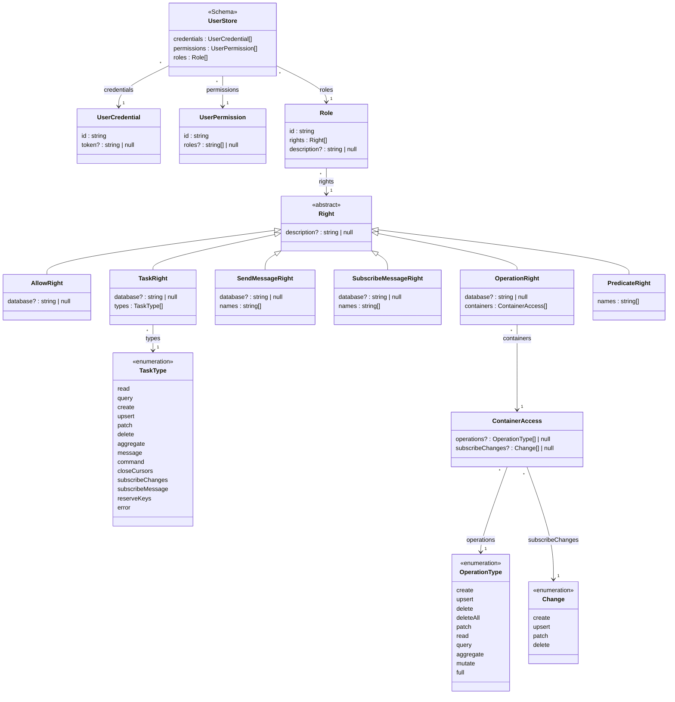

```mermaid
classDiagram

class UserStore {
    <<Schema>>
    credentials  : UserCredential[]
    permissions  : UserPermission[]
    roles        : Role[]
}
UserStore "*" --> "1" UserCredential : credentials
UserStore "*" --> "1" UserPermission : permissions
UserStore "*" --> "1" Role : roles

class UserCredential {
    id     : string
    token? : string | null
}

class UserPermission {
    id     : string
    roles? : string[] | null
}

class Role {
    id           : string
    rights       : Right[]
    description? : string | null
}
Role "*" --> "1" Right : rights

class Right {
    <<abstract>>
    description? : string | null
}

Right <|-- AllowRight
class AllowRight {
    database?    : string | null
}

Right <|-- TaskRight
class TaskRight {
    database?    : string | null
    types        : TaskType[]
}
TaskRight "*" --> "1" TaskType : types

Right <|-- SendMessageRight
class SendMessageRight {
    database?    : string | null
    names        : string[]
}

Right <|-- SubscribeMessageRight
class SubscribeMessageRight {
    database?    : string | null
    names        : string[]
}

Right <|-- OperationRight
class OperationRight {
    database?    : string | null
    containers   : ContainerAccess[]
}
OperationRight "*" --> "1" ContainerAccess : containers

class ContainerAccess {
    operations?       : OperationType[] | null
    subscribeChanges? : Change[] | null
}
ContainerAccess "*" --> "1" OperationType : operations
ContainerAccess "*" --> "1" Change : subscribeChanges

class OperationType {
    <<enumeration>>
    create
    upsert
    delete
    deleteAll
    patch
    read
    query
    aggregate
    mutate
    full
}


Right <|-- PredicateRight
class PredicateRight {
    names        : string[]
}

class TaskType {
    <<enumeration>>
    read
    query
    create
    upsert
    patch
    delete
    aggregate
    message
    command
    closeCursors
    subscribeChanges
    subscribeMessage
    reserveKeys
    error
}


class Change {
    <<enumeration>>
    create
    upsert
    patch
    delete
}


```
