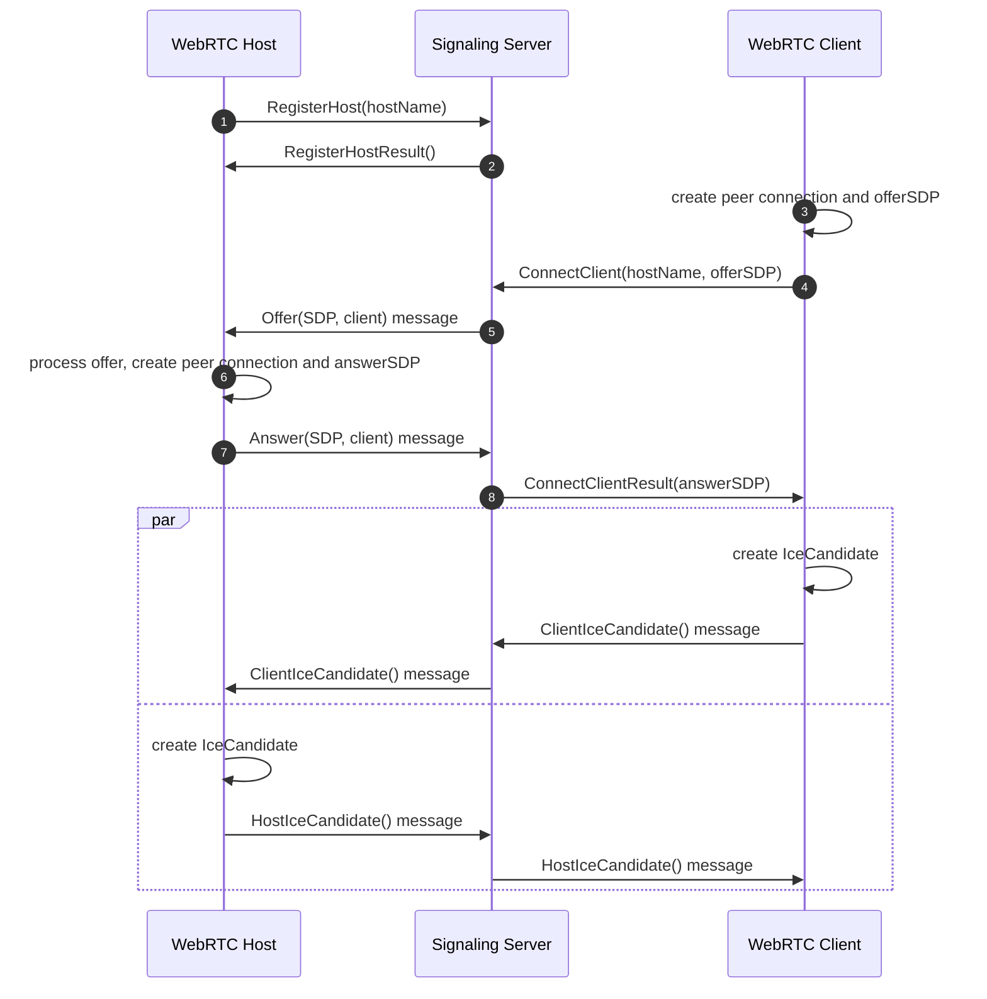

#     **Friflo.Json.Fliox.Hub.WebRTC** 

## Package

This package is part of the project described below.

**Content**  
Contains classes to enable WebRTC connections of HTTP clients to other HTTP clients with Host capabilities.

* Process 1: WebRTC Signaling Server
  - Register HTTP clients with Host capabilities or short: WebRTC Host
  - Enable WebRTC connections of WebRTC-Clients to WebRTC-Hosts by forwarding signaling messages

* Process 2: HTTP client register as a WebRTC Host at the Signaling Server with permanent id/name

* Process 3: HTTP client establish a WebRTC connection to a WebRTC Host via Signaling Server

## Project

**JSON Fliox** is a **.NET** library supporting **simple** and **efficient** access to **NoSQL** databases via C# or Web clients.  
Its **ORM** enables **Schema** creation. Its **Hub** serve hosted databases using these schemas via HTTP.

The **ORM** client - Object Relational Mapper - is used to access NoSQL databases via .NET.  
The **Hub** is a service hosting a set of NoSQL databases via an **ASP.NET Core** server.

## Links

- [Homepage](https://github.com/friflo/Friflo.Json.Fliox)
- [NuGet Package](https://www.nuget.org/packages/Friflo.Json.Fliox.Hub.GraphQL)
- [License](https://github.com/friflo/Friflo.Json.Fliox/blob/main/LICENSE)
- [Stack Overflow](https://stackoverflow.com/questions/tagged/fliox)