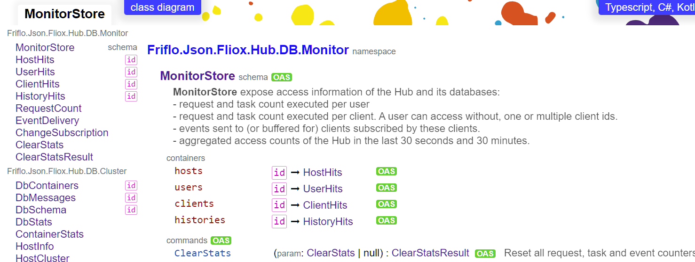
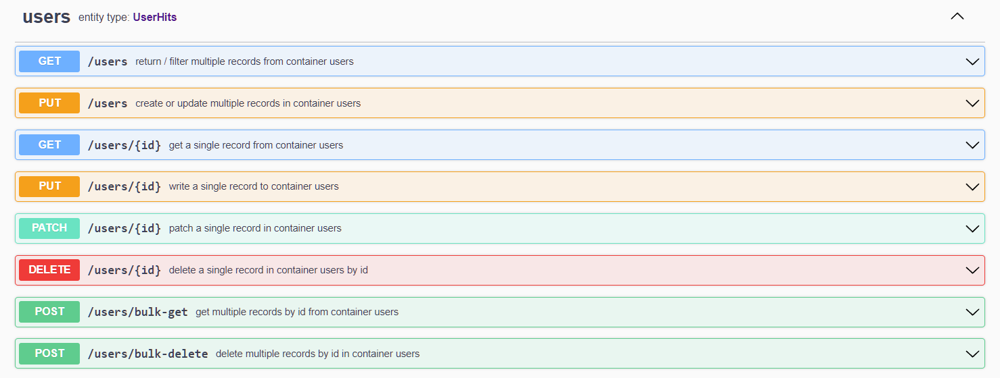
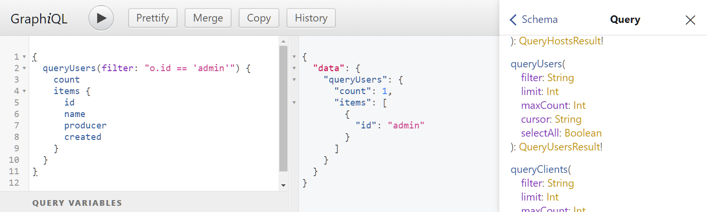

# [](https://github.com/friflo/Friflo.Json.Fliox)        **Schema** 


namespace **`Friflo.Json.Fliox.Schema`**

This namespace contains classes and methods to transform / generate Type Schemas.  
For example to generate a **JSON Schema** from given **C#** model classes or vice vera.  
The schema transformation can be used for any types like database schemas or JSON based protocols.

Another objective of this namespace is to enables type validation for JSON payloads.

Currently supported input type schemas are:
- C#
- [JSON Schema](https://json-schema.org/)

From these input schemas the following output schemas can be generate:

- C#
- Typescript
- Kotlin
- HTML
- JSON Schema / OpenAPI
- GraphQL
- Mermaid

The links in the table above navigate to pages utilizing the generated schemas. See screenshots below.

# 🎨 Features
- Code generators and JSON Validator support the C#/.NET language features:
    - general language types like `class`, `struct` and `enum`
    - primitives types like `long`, `int`, `short`, `byte`, `bool`, `float` & `double`  
      *Note:* intentionally no support of non [CLS-compliant](https://docs.microsoft.com/en-us/dotnet/api/system.clscompliantattribute#remarks)
      primitive types: `ulong`, `uint`, `ushort` & `sbyte`
    - value types of BCL - .NET Base Class Library: `Guid`, `DateTime` and `BigInteger`
    - `Nullable<>` structs, primitives and enums
    - container types like: arrays, `List<>`, `Dictionary<,>`, `Queue<>`, `Stack<>`, ...
    - polymorphic classes with **discriminator** and **discriminants**.
    - namespaces
    - C# **documentation** comments

- Create clear and concise messages for validation errors. E.g.  
    `Missing required fields: [id, name] at Article > (root), pos: 2`

- The JSON Validator is trimmed towards performance by minimizing GC/ Heap pressure and
  aiming for high memory locality.  
  In case of small JSON payloads validation reaches 1.000.000 validations / second.

- Code generators are designed to be small and easy to maintain ~ 300 LOC / language.  
  Also their performance reaches 10.000 schema transformations / second for smaller schemas.

- The generated JSON Schema files are compatible to the specification
  [JSON Schema Draft-07](https://json-schema.org/draft-07/json-schema-release-notes.html).  
  This enables using external **JSON Schema validators** to validate JSON files against the generated schemas.  
  E.g. by [Ajv JSON schema validator](https://ajv.js.org/) running in Node.js or in a browser.

- The generated schemas for various languages are directly available via a **Fliox Hub** in the Browser.  
  To retrieve a zip or a single file click on a schema or type link in the [Hub Explorer](../../Fliox.Hub.Explorer/README.md)
  and follow the link **Typescript, C#, Kotlin, JSON Schema / OpenAPI** on the top of the schema page.


# 📷 Screenshots

Try out the web pages shown as screenshots below.  
They are linked by the online [**DemoHub Explorer**](http://ec2-18-215-176-108.compute-1.amazonaws.com/) (EC2 instance: t2-micro, us-east-1)  

| Link symbol                           | links to                                   |
| ------------------------------------- | ---------------------------------- |
|  | Schema documentation               |
|     | Class Diagram                      |
|   | OpenAPI Specification - Swagger UI |
|   | GraphQL API - GraphiQL             |


### Class Diagram


*screenshot: MonitorStore schema as class diagram*


### Schema Documentation



*screenshot: MonitorStore schema as single page HTML*


### Swagger UI



*screenshot: `monitor` database with Swagger UI*


### GraphiQL


*screenshot: `monitor` database with GraphiQL*


# Examples

## JSON Schema Validation

The input for `JsonValidator.Validate()` is the JSON string and the Type defining the schema - `Person` in the example below.  
Requires nuget package [Friflo.Json.Fliox ](https://www.nuget.org/packages/Friflo.Json.Fliox/).

More examples are at [Fliox.Examples](https://github.com/friflo/Fliox.Examples/tree/main/SchemaValidation).

```csharp
    class Person
    {
                    public  int     age;
        [Required]  public  string  name;
    }
    
    public static class SchemaValidation
    {
        [Test]
        public static void Run() {
            var json = "{\"age\":42,\"name\":\"Peter\"}";
            var success = JsonValidator.Validate(json, typeof(Person), out var error);
            Assert.IsTrue(success);
        }
    }
```

## More examples
- A code example showing code generation based on a C# `Type` is shown at [FlioxClient](../../Fliox.Hub/Client/README.md#schema-generation)

- Examples for code generation and JSON type validation at:  
  [Schema generators & JSON Validation tests](../../../Json.Tests/Common/UnitTest/Fliox/Schema)

- Schema validation for an `EntityDatabase` by a `JSON.Fliox` server is demonstrated at:  
  [TestServer](../../../Json.Tests/Main/Program.cs)

