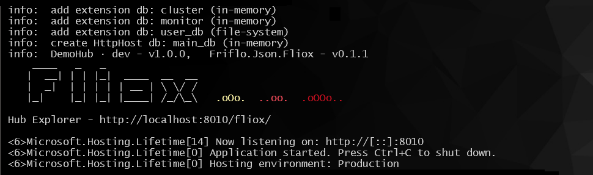
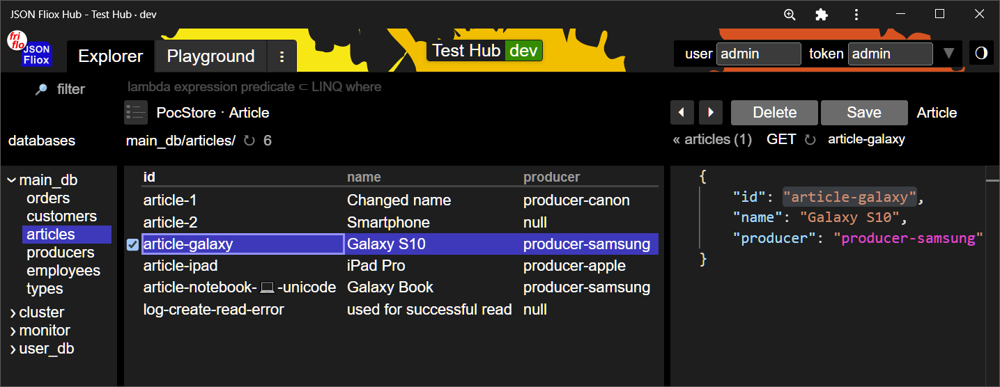
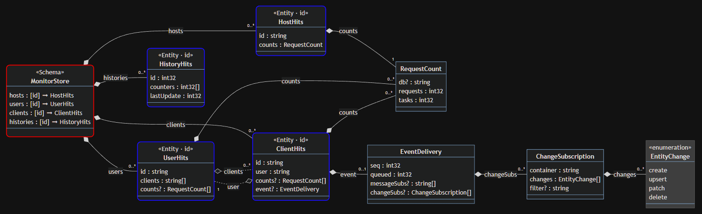
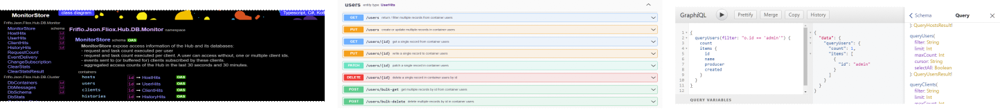

# [](https://github.com/friflo/Friflo.Json.Fliox)    **JSON Fliox** 

[](https://www.nuget.org/packages/Friflo.Json.Fliox.Hub) 
[](https://github.com/friflo/Friflo.Json.Fliox/actions/workflows/dotnet.yml) 
[](https://github.com/friflo/Friflo.Json.Fliox/actions/workflows/nuget.yml) 

 2024-02-19 · New features in [**Friflo.Engine.ECS - v.1.17.0**](Engine/README.md)  
Added new features focusing on performance:
- Add support for multi threaded query (system) execution.
- Added command buffers typically used in multi threaded queries.
- Support entity creation as batch and bulk operation.
- Support entity changes - add/remove components and tags - as batch and bulk operation.
- Add SIMD support in multi threaded queries. Execute SIMD operations without a scalar remainder loop.


 2024-01-17 · Published new package [**Friflo.Engine.ECS**](Engine/README.md) on nuget.  
An **Entity Components System** optimized for performance and cache locality.

<br/>

### **JSON Fliox**

A client / server **ORM** for **.NET** for **SQL & NoSQL** databases with focus on Web apps and performance.  
Database access is realized by creating a single class to query, create, update or delete table / container records.  

This class - a **`FlioxClient`** - provide type safety and support validation, batching, transactions and messaging.  
A **`FlioxHub`** can be used to serve hosted databases via HTTP using **ASP.NET Core** or an **HttpListener**.

As Fliox is an [ORM](https://en.wikipedia.org/wiki/Object-relational_mapping) it has similarities to projects like
[Entity Framework Core](https://en.wikipedia.org/wiki/Entity_Framework),
[Ruby on Rails](https://en.wikipedia.org/wiki/Ruby_on_Rails),
[Django](https://en.wikipedia.org/wiki/Django_(web_framework)) or
[Hibernate](https://en.wikipedia.org/wiki/Hibernate_(framework))

<br/>

### **Unique ORM Features**

As of writing this the list below show unique features not supported by other ORMs like:  
EFCore, Dapper, NHibernate, LINQ to DB, PetaPoco or ServiceStack.

- Fliox provide two schema models for all SQL databases:

  - **Relational** - the default - storing each entity class property in its own column. 

  - **JSON columns** storing entities in a single column called: `json_data`.  
    This enables schema changes without database migrations and avoid [OR impedance mismatch](https://en.wikipedia.org/wiki/Object%E2%80%93relational_impedance_mismatch).

- Create automatically common **REST route handlers** `GET`, `PUT`, `PATCH`, `DELETE` to execute [LINQ query filters](https://github.com/friflo/Friflo.Json.Fliox/blob/main/Json/Fliox.Hub/Client/README.md#query-filter)  
  and CRUD operations (bulk or single resource) for each table using ASP.NET Core.

- `FlioxClient`'s can be used **client-side** on user devices by using a HTTP or WebSocket connection.  
  Using the listed ORMs above require to disclose the database credentials to the public.  

- `FlioxClient`'s can also be used in **web applications** (JS/WASM) using HTTP or WebSocket's.  
  Not supported by the mentioned ORMs as they require proprietary - non HTTP based - protocols.

- Support **Pub-Sub** to receive push events for subscribed database changes like: create, update, delete & merge.

- Provide a Web UI - the **Hub Explorer** - to explore databases using a web browser.

- Supports **batching**. Multiple database operations are combined into a single request send to the server.  
  This enables execution of database transactions in a single request and enable non-chatty data communication.


**TL;DR**

Try the example Hub online running on AWS - [**DemoHub**](http://ec2-18-215-176-108.compute-1.amazonaws.com/) (EC2 instance: t2-micro, us-east-1)  
The **DemoHub** .NET project is available at
[**🚀 friflo/Fliox.Examples**](https://github.com/friflo/Fliox.Examples/blob/main/README.md#-content).

*Note*: JSON Fliox is **not** a UI library. It is designed for simple integration in .NET and Web UI frameworks.

<br/>


## 🚩 Content

- [Features](#-features)
- [Quickstart](#-quickstart)
- [Providers](#-database-providers)
- [Examples](#-examples)           ❯  [🚀 friflo/Fliox.Examples](https://github.com/friflo/Fliox.Examples/blob/main/README.md#-content)
- [Hub](#-hub)
    - [Client](#client)                 ❯  [README.md](Json/Fliox.Hub/Client/README.md)
    - [Host](#host)                   ❯  [README.md](Json/Fliox.Hub/Host/README.md)
    - [Explorer](#explorer)             ❯  [README.md](Json/Fliox.Hub.Explorer/README.md)
    - [DB](#db)                      ❯  [README.md](Json/Fliox.Hub/DB/README.md)
    - [Protocol](#protocol)             ❯  [README.md](Json/Fliox.Hub/Protocol/README.md)
- [Fliox](#-fliox)
    - [Schema](#schema)              ❯  [README.md](Json/Fliox/Schema/README.md)
    - [Mapper](#mapper)              ❯  [README.md](Json/Fliox/Mapper/README.md)
- [Project](#-project)
    - [API](#api)                     ❯  [friflo/fliox-docs](https://github.com/friflo/fliox-docs)
    - [Properties](#properties)
    - [Principles](#principles)
    - [Build](#build)                  ❯  [README.md](Json.Tests/README.md)
- [Motivation](#-motivation)
- [Credits](#-credits)


<br/>

## 🎨 Features

Compact list of features supported by Clients and Hubs
- ASP.NET Core & HttpListener integration
    - REST API - JSON Schema / OpenAPI
    - GraphQL API
    - Batch API - HTTP, WebSocket & UDP
- Database
    - CRUD operations - bulk and single resource
    - Transactions - Begin, Commit & Rollback - for SQL databases
    - Schema
    - Queries - LINQ expressions
    - Container relations (associations)
    - Entity validation
    - Send messages (event) & commands (RPC) with validation
    - Pub-Sub - entity changes, messages and commands
- Hub Explorer - the admin page
- Monitoring
- Authentication / Authorization
- Code generation
    - C#, Typescript & Kotlin
    - JSON Schema, OpenAPI Schema & GraphQL Schema
    - Schema documentation & class diagram
- Compatibility
    - Frameworks: .NET, .NET Core, .NET Framework and .NET Standard
    - tested on Windows, macOS, Linux & Unity 2021 or higher

Features are explained in more detail in the sections: [Hub](#-hub) and [Fliox](#-fliox)

|                    Performance characteristics                            |                                                                                                             |
| ------------------------------------------------------------------------- | ----------------------------------------------------------------------------------------------------------- |
| **RTT**           request / response roundtrip                            | **0.3 ms**                                                                                                  |
| **Pub-Sub delay** send message ➞ subscriber event                        | **sub millisecond latency**                                                                                 |
| **Pub-Sub throughput FIFO** 3 subscribers each using a WebSocket          | **50k messages / sec**                                                                                      |
| **Query**         request 1M rows, each row 124 byte => response 125MB    | **1.3 sec**                                                                                                 |
| **Throughput**    request / response WebSocket, 4 concurrent clients      | **27k requests / sec**                                                                                      |
| **ASP.NET Core**  Hub integration                                         | **1 LOC** [Startup.cs](https://github.com/friflo/Fliox.Examples/blob/main/Demo/Hub/Startup.cs#L24)          |
| **Minimal Client & Server** with: REST, CRUD, Queries, Pub-Sub & Explorer | **60 LOC** [Client](https://github.com/friflo/Fliox.Examples/blob/main/Todo/Client/TodoClient.cs) & [Server](https://github.com/friflo/Fliox.Examples/blob/main/Todo/Hub/Program.cs) |
| &nbsp;           run on Intel(R) Core(TM) i7-4790K CPU 4.00GHz            |                                                                                                |

<br/>

## ⏩ **Quickstart**

### **Direct database access**

Create a **Console Application** and add the following dependencies:  
[](https://www.nuget.org/packages/Friflo.Json.Fliox.Hub)
[](https://www.nuget.org/packages/Friflo.Json.Fliox.Hub.SQLite)
```
dotnet add package Friflo.Json.Fliox.Hub
dotnet add package Friflo.Json.Fliox.Hub.SQLite
```

Create a `TodoClient` client to specify the database schema.

📄 `TodoClient.cs`
```csharp
public class TodoClient : FlioxClient
{
    // --- containers
    public  readonly    EntitySet <long, Job>   jobs;
    
    public TodoClient(FlioxHub hub, string dbName = null) : base (hub, dbName) { }
}

// ---------------------------------- entity models ----------------------------------
public class Job
{
    [Key]       public  long    id;
    [Required]  public  string  title;
                public  bool?   completed;
}
```

The following code create / open a <b>SQLite</b> database by using `TodoClient` as the database schema.  
It also perform some database operations like: `UpsertRange()` & `Query()`

📄 `Program.cs`
```csharp
    var schema      = DatabaseSchema.Create<TodoClient>();
    var database    = new SQLiteDatabase("todo_db", "Data Source=todo.sqlite3", schema);
    await database.SetupDatabaseAsync(); // for development: create database or update ist schema
    var hub         = new FlioxHub(database);

    var client      = new TodoClient(hub);
    client.jobs.UpsertRange(new[] {
        new Job { id = 1, title = "Buy milk", completed = true },
        new Job { id = 2, title = "Buy cheese", completed = false }
    });
    var jobs = client.jobs.Query(job => job.completed == true);
    await client.SyncTasks(); // execute UpsertRange & Query task

    foreach (var job in jobs.Result) {
        Console.WriteLine($"{job.id}: {job.title}");
    }
    // output:  1: Buy milk
```

Run the application
```
dotnet run
```

<br/>

### **Remote database access**

Remote database access - client / servers setup - require two console applications:
1. [HTTP server](#1-http-server)  to host a single - or multiple - databases
2. [HTTP client](#2-http-client)  to access a hosted database


#### **1. HTTP Server**

Add dependency to **Hub Explorer** to host a Web UI to browse databases.  
The **Hub Explorer** is optional but speedup development. It contains the static files for the Web UI.  
[](https://www.nuget.org/packages/Friflo.Json.Fliox.Hub.Explorer)
```
dotnet add package Friflo.Json.Fliox.Hub.Explorer
```

Replace the code in 📄 `Program.cs` above to host a database by an HTTP server.

📄 `Program.cs` *(server)*
```csharp
    var schema      = DatabaseSchema.Create<TodoClient>();
    var database    = new SQLiteDatabase("todo_db", "Data Source=todo.sqlite3", schema);
    await database.SetupDatabaseAsync(); // for development: create database or update ist schema
    var hub         = new FlioxHub(database);
    hub.Info.Set ("TodoHub", "dev", "https://github.com/friflo/Fliox.Examples/tree/main/Todo", "rgb(0 171 145)"); // optional
    hub.UseClusterDB(); // required by HubExplorer
    hub.UsePubSub();    // optional - enables Pub-Sub
    // --- create HttpHost
    var httpHost    = new HttpHost(hub, "/fliox/");
    httpHost.UseStaticFiles(HubExplorer.Path); // nuget: https://www.nuget.org/packages/Friflo.Json.Fliox.Hub.Explorer
    
    HttpServer.RunHost("http://localhost:5000/", httpHost); // http://localhost:5000/fliox/
```

Start the server and check the **Hub Explorer** is available at http://localhost:5000/fliox/
```
dotnet run
```

**ASP.NET Core integration**

ASP.NET Core integration requires the nuget package.  
[](https://www.nuget.org/packages/Friflo.Json.Fliox.Hub.AspNetCore)
```
dotnet add package Friflo.Json.Fliox.Hub.AspNetCore
```

Integration into an existing `WebApplication` `app` is enabled adding

```csharp
    app.MapHost("/fliox/{*path}", httpHost);`
```

Or create an `WebApplication` from scratch by replacing `HttpServer.RunHost()` in the snippet above by

```csharp
    var app = WebApplication.Create();
    app.MapRedirect("/", httpHost);
    app.MapHost("/fliox/{*path}", httpHost);
    app.Run();
```

<br/>

*C# documentation in Hub Explorer (optional)*

The C# documentation of `TodoClient` and other model classes can be utilized in the Hub Explorer.  
Therefor add the following xml snippet to the *.csproj. It will copy the *.xml files next to the *.dll files.  
The server read and add the documentation to schema definition.

```xml
  <PropertyGroup>
	<GenerateDocumentationFile>True</GenerateDocumentationFile>
  </PropertyGroup>
  <!-- Copy XML files from all PackageReferences to output dir -->
  <Target Name="_ResolveCopyLocalNuGetPkgXmls" AfterTargets="ResolveReferences">
    <ItemGroup>
      <ReferenceCopyLocalPaths Include="@(ReferenceCopyLocalPaths->'%(RootDir)%(Directory)%(Filename).xml')" Condition="'%(ReferenceCopyLocalPaths.NuGetPackageId)'!='' and Exists('%(RootDir)%(Directory)%(Filename).xml')" />
    </ItemGroup>
  </Target>
```

<br/>

#### **2. HTTP Client**

Create a second **Console application** to access the hosted database via HTTP.

Add required nuget dependencies  
[](https://www.nuget.org/packages/Friflo.Json.Fliox.Hub)
```
dotnet add package Friflo.Json.Fliox.Hub
```
Copy 📄 TodoClient.cs from above to Console project.  

- *Note:* The intention is to implement the `TodoClient` and its model classes in a separate library project.  
  Client & server applications reference this library as their dependency.  
  But for simplicity create a copy in the client application for now.

📄 `Program.cs` *(client)*
```csharp
    var hub     = new WebSocketClientHub("todo_db", "ws://localhost:5000/fliox/");
    var client  = new TodoClient(hub);
    var jobs    = client.jobs.Query(job => job.completed == true);
    client.jobs.SubscribeChanges(Change.All, (changes, context) => {
        Console.WriteLine(changes);
    });
    await client.SyncTasks(); // execute Query & SubscribeChanges task

    foreach (var job in jobs.Result) {
        Console.WriteLine($"{job.id}: {job.title}");
    }
    // output:  1: Buy milk
    Console.WriteLine("\n wait for events ... (exit with: CTRL + C)\n note: generate events by clicking 'Save' on a record in the Hub Explorer\n");
    await Task.Delay(3_600_000); // wait 1 hour
```

Ensure the server is running and start the client application
```
dotnet run
```

<br/>

## ⛁ **Database providers**

| Database        | class / nuget        | connection string examples                                               
| --------------- | -------------------- | ----------------------------------------------------------------------------------------------------------------------------------------------------------------------------------------- |
| **in-memory**   | `MemoryDatabase`     | *none*
|                 | *build-in*           | 
| **file-system** | `FileDatabase`       | *path of root folder*
|                 | *build-in*           | 
| **SQLite**      | `SQLiteDatabase`     | `"Data Source=test_db.sqlite3"`
|                 | [](https://www.nuget.org/packages/Friflo.Json.Fliox.Hub.SQLite#readme-body-tab)             | `dotnet add package Friflo.Json.Fliox.Hub.SQLite`
| **MySQL**       | `MySQLDatabase`      | `"Server=localhost;User ID=root;Password=;Database=test_db;"`
|                 | [](https://www.nuget.org/packages/Friflo.Json.Fliox.Hub.MySQL#readme-body-tab)                | `dotnet add package Friflo.Json.Fliox.Hub.MySQL`
| **MariaDB**     | `MariaDBDatabase`    | `"Server=localhost;User ID=root;Password=;Database=test_db;"`
|                 | [](https://www.nuget.org/packages/Friflo.Json.Fliox.Hub.MySQL#readme-body-tab)                | `dotnet add package Friflo.Json.Fliox.Hub.MySQL`
| **PostgreSQL**  | `PostgreSQLDatabase` | `"Host=localhost;Username=postgres;Password=postgres;Database=test_db;"`
|                 | [](https://www.nuget.org/packages/Friflo.Json.Fliox.Hub.PostgreSQL#readme-body-tab) | `dotnet add package Friflo.Json.Fliox.Hub.PostgreSQL`
| **SQL Server**  | `SQLServerDatabase`  | `"Data Source=.;Integrated Security=True;Database=test_db"`
|                 | [](https://www.nuget.org/packages/Friflo.Json.Fliox.Hub.SQLServer#readme-body-tab)    | `dotnet add package Friflo.Json.Fliox.Hub.SQLServer`

The **connection string** of each provider is documented in its nuget `README`

Example snippet to create a database using SQLite looks like:

```csharp
    var connection  = "Data Source=todo_db.sqlite3";
    var schema      = DatabaseSchema.Create<TodoClient>();
    var database    = new SQLiteDatabase("todo_db", connection, schema);
```

<br/>

## 🚀 **Examples**
📄   [friflo/Fliox.Examples](https://github.com/friflo/Fliox.Examples/blob/main/README.md#-content)

A separate git repository with two small **ready-to-run** examples (70 LOC & 550 LOC) using Fliox Clients and Servers.  
Build and run a server with [**Gitpod**](https://github.com/friflo/Fliox.Examples/blob/main/README.md#-build) using VSCode in the browser without installing anything.

[](https://github.com/friflo/Fliox.Examples/blob/main/README.md#-content)  
*screenshot: DemoHub server logs*
<br/><br/>


## 📦 **Hub**

Namespace    Friflo.Json.Fliox.Hub.*  
Assembly     Friflo.Json.Fliox.Hub.dll  <a href="https://www.nuget.org/packages/Friflo.Json.Fliox.Hub">
  
</a>

### **Client**
📄   [README.md](Json/Fliox.Hub/Client/README.md)

Fliox clients are strongly typed C# classes used to access SQL or NoSQL databases.  
They are implemented by creating a class e.g. `MyClient` extending `FlioxClient`.  
The database containers are represented as properties in the derived class `MyClient`.  

These classes also acts as a database schemas. They can be assigned to databases hosted on the Hub.  
Doing this enables features like:
- JSON validation of entities aka records
- generate a JSON Schema, an OpenAPI Schema and a GraphQL Schema
- generate a HTML Schema documentation and a UML class diagram
- generate classes for various programming languages: C#, Typescript & Kotlin

The `MyClient` can be used to declare custom database commands using DTO's as input and result types.


### **Host**
📄   [README.md](Json/Fliox.Hub/Host/README.md)

A `HttpHost` instance is used to host multiple databases.  
It is designed to be integrated into HTTP servers like **ASP.NET Core**.  
This enables access to hosted databases via HTTP, WebSocket or UDP supporting the following Web API's:
- REST
- GraphQL
- Batch API

A `FlioxHub` instance is used to configure the hosted databases, authentication / authorization and Pub-Sub.  
This `FlioxHub` instance need to be passed to the constructor of the `HttpHost`

### **Explorer**
📄   [README.md](Json/Fliox.Hub.Explorer/README.md)  
Assembly     Friflo.Json.Fliox.Hub.Explorer.dll  <a href="https://www.nuget.org/packages/Friflo.Json.Fliox.Hub.Explorer">
  
</a>

The Hub Explorer is an admin page used to access
databases, containers and entities hosted by a Fliox Hub.  
The Explorer also enables to execute application specific database commands.

[](Json/Fliox.Hub.Explorer/README.md)  
*screenshot: Hub Explorer*

### **DB**
📄   [README.md](Json/Fliox.Hub/DB/README.md)

Provide a set of support databases used to:
- serve the Hub configuration - used by the Hub Explorer. Schema:
  [ClusterStore](Json.Tests/assets~/Schema/Markdown/ClusterStore/class-diagram.md)
- serve monitoring data. Schema:
  [MonitorStore](Json.Tests/assets~/Schema/Markdown/MonitorStore/class-diagram.md)
- perform user authentication, authorization and management. Schema:
  [UserStore](Json.Tests/assets~/Schema/Markdown/UserStore/class-diagram.md)

### **Protocol**
📄   [README.md](Json/Fliox.Hub/Protocol/README.md)

The Protocol is the communication interface between a `FlioxClient` and a `FlioxHub`.  
Web clients can use this Protocol to access a Hub using the Batch API via HTTP & JSON.  
A language specific API - e.g. written in Typescript, Kotlin, ... - is not a requirement.

The Protocol is not intended to be used by C# .NET clients directly.  
Instead they are using a `FlioxClient` that is optimized to transform API calls into the Protocol.

<br/><br/>


## 📦 **Fliox**

Namespace    Friflo.Json.Fliox.*  
Assembly     Friflo.Json.Fliox.dll  <a href="https://www.nuget.org/packages/Friflo.Json.Fliox">
  
</a>


### **Schema**
📄   [README.md](Json/Fliox/Schema/README.md)

This module enables transforming schemas expressed by a set of C# classes into
other programming languages and schema formats like:

- C#, Typescript, Kotlin
- HTML documentation, Schema Class Diagram
- JSON Schema, OpenAPI Schema, GraphQL Schema

Its main purpose is to generate schemas and types for various languages of classes extending `FlioxClient`.  
The screenshots below show Hub pages utilizing the schemas mentioned above.

[](Json/Fliox/Schema/README.md#class-diagram)  
*screenshot: MonitorStore schema as class diagram*


[](Json/Fliox/Schema/README.md#html-documentation)  
*screenshots: Schema documentation, Swagger UI & GraphiQL*


### **Mapper**
📄   [README.md](Json/Fliox/Mapper/README.md)

This module enables serialization / deserialization of C# .NET objects to / from JSON.  
Its feature set and API is similar to the .NET packages:
- [JamesNK/Newtonsoft.Json](https://github.com/JamesNK/Newtonsoft.Json)
- [System.Text.Json](https://docs.microsoft.com/en-us/dotnet/api/system.text.json)

The module is utilized by the assembly `Friflo.Json.Fliox.Hub` to serialize entities and DTO's.  
Its also used for serialization of the supported protocols: REST, GraphQL and Batch API.

<br/><br/>


## 🔧 **Project**

### **API**

The Fliox **C# .NET** API is [CLS-compliant](https://docs.microsoft.com/en-us/dotnet/api/system.clscompliantattribute#remarks)  
The API is available at [**fliox-docs API Reference**](https://github.com/friflo/fliox-docs)


### **Properties**

The goal of the library, its components and API is to be easy digestible for software developers.  
The properties describe the characteristics of this project - at least what it aims for.  
These properties are targeted to the needs of users using the library.  
They fit mostly the aspects described in [CUPID-for joyful coding](https://dannorth.net/2022/02/10/cupid-for-joyful-coding/).

Topics of the CUPID properties focused by this project are
- Composable
    - **No 3rd party dependencies**
    - [Compatibility](./docs/compatibility.md)
      **.NET Core 3.1** or higher, **.NET Framework 4.6.2** or higher and **Unity 2020.1** or higher
    - Seamless integration into existing ASP.NET Core applications with a handful lines of code
    - Independence from other parts of existing applications
    - Fliox Clients and Hubs are unit testable without mocking
    - Replace the underlying database without changing application code
    - Add custom code / schema generators without changing the application code
- Predictable
    - API surface is as small as possible
    - API: class, method and property names are short, simple, and easy to pronounce
    - Observable
        - Monitoring is integral part of the Hub
        - The `ToString()` methods of classes show only relevant state to avoid noise in debugging sessions
        - Error and runtime assertion messages are short and expressive
- Domain based
    - Enable implementing compact applications which are easy to read and to maintain

### Principles

A set of rules followed by this project to aim for simplicity and performance. See [Principles](docs/principles.md)

### **Build**
📄   [README.md](Json.Tests/README.md)

The project **Json.Tests** contains a console application and unit tests.  
Build and run instructions for .NET and Unity are in the README file.

**unit tests**  
Code coverage: **86%** measured with **JetBrains • docCover**

```yaml
Passed! - Failed: 0, Passed: 842, Skipped: 0, Total: 842, Duration: 7 s - Friflo.Json.Tests.dll (net6.0)
```
*summarized logs of unit test execution* - they are executed in  
<a href="https://github.com/friflo/Friflo.Json.Fliox/actions/workflows/dotnet.yml">
  
</a>


<br/>

## 🔥 Motivation

The main driver of this project is the development of an competitive online multiplayer game -
a still unresolved task in my todo list.  
The foundation to achieve this is commonly a module called *Netcode* in online multiplayer games.  
The key aspects of *Netcode* are: Synchronizing game state, messaging, low latency, high throughput,
minimal use of system resources, reliability & easy to use API.  
As Unity is selected as the Game engine C# .NET is the way to go.

Another objective is to create an open source software project which may have the potential to be popular.  
As I have 15+ years experience as a software developer in enterprise environment - Shout-Out to [HERE Technologies](https://www.here.com/) -
I decided to avoid a Vendor Lock-In to Unity and target for a solution which fits also the needs of common .NET projects.  
So development is entirely done with .NET Core while checking Unity compatibility on a regular basis.

The result is a project with a feature set useful in common & gaming projects and targeting for optimal performance.  
The common ground of both areas is the need of databases.  
In context of game development the game state (Players, NPC, objects, ...) is represented as an in-memory database
to enable low latency, high throughput and minimal use of system resources.  
In common projects databases are used to store any kind of data persistent by using a popular DBMS.  
Specific for online gaming is the ability to send messages from one client to another in *real time*.
This is enabled by supporting Pub-Sub with sub millisecond latency on *localhost*.

<br/>


## 🙏 Credits
|                                                                           |             |                                                                      |
| ------------------------------------------------------------------------- | ----------- | -------------------------------------------------------------------- |
| [NUnit](https://nunit.org/)                                               | C#          | unit testing of the library in the CLR and Unity                     |
| [FluentAssertions](https://github.com/fluentassertions/fluentassertions)  | C#          | unit testing of the library                                          |
| [SQLitePCL.raw](https://github.com/ericsink/SQLitePCL.raw)                | C#          | used by DB Provider for SQLite                                       |
| [SqlClient](https://github.com/dotnet/SqlClient)                          | C#          | used by DB Provider for Microsoft SQL Server                         |
| [MySqlConnector](https://github.com/mysql-net/MySqlConnector)             | C#          | used by DB Provider for MySQL, MariaDB and MySQL compatible DBMS     |
| [Npgsql](https://github.com/npgsql/npgsql)                                | C#          | used by DB Provider for PostgreSQL                                   |
| [Microsoft.Azure.Cosmos](https://github.com/Azure/azure-cosmos-dotnet-v3) | C#          | used by DB Provider for CosmosDB                                     |
| [SIPSorcery](https://github.com/sipsorcery-org/sipsorcery)                | C#          | WebRTC - Real-time communication between Web clients without server  |
| [GraphQL.NET Parser](https://github.com/graphql-dotnet/parser)            | C#          | used by package: Friflo.Json.Fliox.Hub.GraphQL                       |
| [MdDocs](https://github.com/ap0llo/mddocs)                                | C#          | for [fliox-docs API Reference](https://github.com/friflo/fliox-docs) |
| [.NET platform](https://dotnet.microsoft.com/en-us/)                      | C# .NET     | the platform providing compiler, runtime, IDE's & ASP.NET Core       |
| [Swagger](https://swagger.io/)                                            | static JS   | a REST / OpenAPI UI linked by the Hub Explorer                       |
| [GraphiQL](https://github.com/graphql/graphiql)                           | static JS   | a GraphQL UI linked by the Hub Explorer                              |
| [Mermaid](https://github.com/mermaid-js/mermaid)                          | static JS   | class diagram for database schema linked by the Hub Explorer         |
| [Monaco Editor](https://github.com/microsoft/monaco-editor)               | static JS   | used as JSON editor integrated in the Hub Explorer                   |
| [WinMerge](https://github.com/WinMerge/winmerge)                          | Application | heavily used in this project                                         |
| [Inscape](https://gitlab.com/inkscape/inkscape)                           | Application | to create SVG's for this project                                     |

<br/>

💖 *Like this project?*  
*Leave a* ⭐ at  [friflo/Friflo.Json.Fliox](https://github.com/friflo/Friflo.Json.Fliox)

Happy coding!  

<br/>

## License

This project is licensed under AGPLv3.  

friflo JSON Fliox  
Copyright © 2023   Ullrich Praetz
