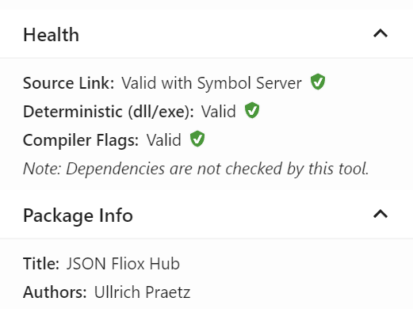

Green Health checkmark at

https://www.nuget.org/packages/Friflo.Json.Fliox.Hub/  

Click: **Open in NuGet Package Explorer**

e.g. at: https://nuget.info/packages/Friflo.Json.Fliox.Hub/0.3.14



Requires settings in `*.csproj` files

```
    </PropertyGroup>
        ...
        <PublishRepositoryUrl>true</PublishRepositoryUrl>
        <IncludeSymbols>true</IncludeSymbols>
        <SymbolPackageFormat>snupkg</SymbolPackageFormat>
        <EmbedAllSources>true</EmbedAllSources>
    </PropertyGroup>
    <PropertyGroup Condition="'$(GITHUB_ACTIONS)' == 'true'">
        <ContinuousIntegrationBuild>true</ContinuousIntegrationBuild>
    </PropertyGroup>

    <ItemGroup>
        ...
        <PackageReference Include="Microsoft.SourceLink.GitHub" Version="1.1.1" PrivateAssets="All" />
    </ItemGroup>

```

